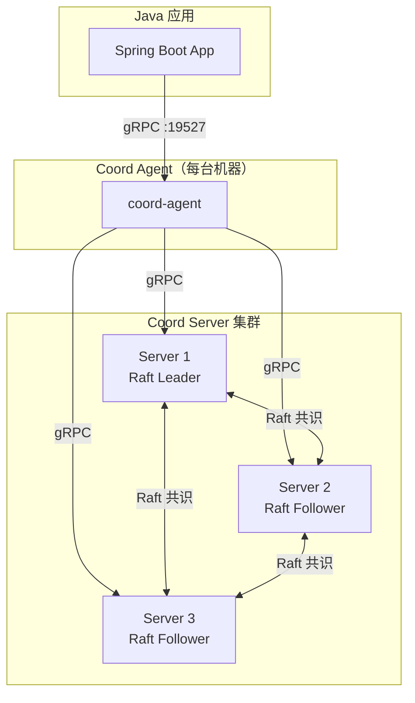

# Coord

<div align="center">

[](LICENSE)
[](rust-toolchain.toml)
[](coord-spring-boot-starter/pom.xml)

</div>

- **Coord** 是一个分布式协调服务，为微服务架构提供 KV 存储、原子事务、租约管理、变更监听、服务注册与工作流编排等核心原语。Coord 采用 Raft 共识协议保证数据强一致性，支持 Multi-Raft 水平扩展，并通过 Agent 模式为 Java 微服务提供零代码接入体验。
- 当前应用由 deepseek v4 协助开发，主要验证研究 deepseek v4 在中大型项目的代码能力，**不可以用于真实业务**
---

## 架构概览



## 核心特性

| 原语 | 描述 | 状态 |
|:---|:---|:---:|
| **KV** | 分布式 Key-Value 存储，支持 Put/Get/Delete/Range | ✅ |
| **Txn** | Compare-And-Swap 原子事务，支持多操作原子提交 | ✅ |
| **Watch** | Key 变更监听，支持前缀匹配与历史回放 | ✅ |
| **Lease** | 租约管理（Grant/Revoke/KeepAlive），支持 Key 绑定自动过期 | ✅ |
| **Lock** | 分布式锁 API | ✅ |
| **Registry** | 服务注册/发现，与 Lease 绑定实现自动过期 | ✅ |
| **Workflow** | 工作流状态机编排 + Saga 补偿执行器 | ✅ |
| **Auth/RBAC** | 认证鉴权（用户/角色/权限），令牌管理 | ✅ |
| **TLS/mTLS** | 传输层安全加密 | ✅ |
| **Barrier** | AES-256-GCM 存储加密（静止数据保护） | ✅ |
| **Seal/Unseal** | Shamir Secret Sharing 密钥分片管理 | ✅ |
| **Multi-Raft** | Region 分片 + PD 调度，支持水平扩展 | ✅ |
| **Compaction** | 自动 MVCC 版本压缩 | ✅ |
| **Snapshot** | 快照创建/恢复 | ✅ |

## 项目结构

```
coord/
├── coord/                  # CLI 二进制入口（server/agent/dev 子命令）
├── coord-proto/            # Protobuf/gRPC 契约定义（7 个 proto 文件）
├── coord-core/             # 公共 Trait 与类型（StorageBackend/Error/Region）
├── coord-server/           # 服务端实现（Raft/MVCC/Txn/Watch/Lease/Auth/TLS）
├── coord-agent/            # Agent 守护进程（本地代理，Java 应用入口）
├── coord-client/           # Rust 客户端 SDK（gRPC + Leader 发现 + 重试）
├── coord-macros/           # 派生宏（ValidateRevision/Builder）
├── coord-test/             # 测试工具（MockStorage/DataGenerator）
├── coord-spring-boot-starter/  # Spring Boot 自动配置 Starter
├── coord-ui/               # Web 管理界面（React + Vite）
├── java-example/           # Java 接入示例
├── docs/                   # 架构文档与设计决策
└── scripts/                # 构建与基准测试脚本
```

## 快速开始

### 前置条件

- Rust 1.93.0（通过 `rust-toolchain.toml` 固定）
- Java 21+（仅 Java Starter / 示例）
- Maven 3.9+（仅 Java 模块）

### 构建

```bash
# 构建全部 Rust Crate
cargo build

# 运行所有测试
cargo test

# 仅构建发布版
cargo build --release
```

### 启动开发模式

```bash
# 开发模式：同时启动 Server + Agent
cargo run -- dev

# 启动单节点 Server
cargo run -- server --config config.toml

# 启动 Agent（Java 应用连接 localhost:19527）
cargo run -- agent --config agent.toml
```

### Java 应用接入

```xml
<dependency>
    <groupId>cn.byteforce</groupId>
    <artifactId>coord-spring-boot-starter</artifactId>
    <version>0.1.0</version>
</dependency>
```

```yaml
# application.yml
coord:
  agent:
    host: localhost
    port: 19527
```

## 技术栈

| 组件 | 技术选型 | 版本 |
|:---|:---|:---|
| 异步运行时 | Tokio | 1.49 |
| gRPC 框架 | Tonic + Prost | 0.14 |
| Raft 共识 | Openraft | 0.10.0-alpha.25 |
| 存储引擎 | Redb | 4.1 |
| 内存安全 | Zeroize | 1.8 |
| CLI | Clap | 4.x |
| 前端 | React + Vite + TypeScript | 19.x |
| Java Starter | Spring Boot | 3.4.x |


## 许可

本项目采用 [MIT License](LICENSE)。

---
