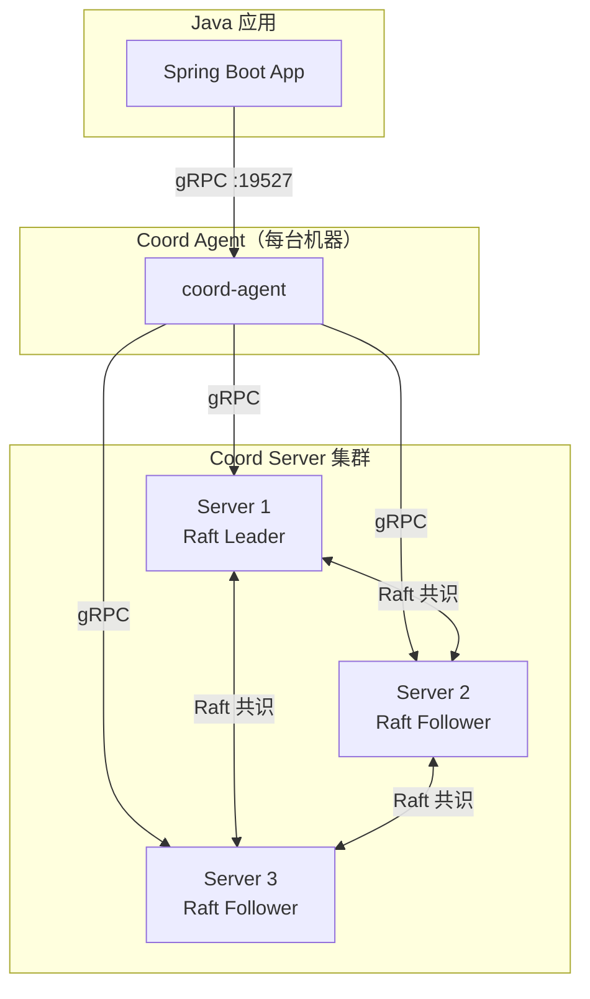

# Coord

<div align="center">

[](LICENSE)
[](rust-toolchain.toml)
[](coord-spring-boot-starter/pom.xml)

</div>

- **Coord** 是一个分布式协调服务，为微服务架构提供 KV 存储、原子事务、租约管理、变更监听、服务注册与工作流编排等核心原语。Coord 采用 Raft 共识协议保证数据强一致性（生产形态为**单 Raft 组 + 定期快照备份**；Multi-Raft/PD 为 experimental、未接入生产路径），并通过 Agent 模式为 Java 微服务提供零代码接入体验。
- **⚠️ 当前处于生产化重构中（M1 止血阶段），尚未达到生产可用**。底层 Raft + MVCC 已真实重建，但静态加密未接线、快照链路不可信、Range/Txn 语义有缺陷、follower 写不可重定向、关键指标零写入方——详见 [`docs/production/17-refactor-master-plan.md`](docs/production/17-refactor-master-plan.md)（唯一现行执行文档）。以下特性表按「组件级 / 集成级 / 生产验证级」三级口径标注。
---

## 架构概览


```mermaid
graph TD
    subgraph "Java 应用"
        APP[Spring Boot App]
    end

    subgraph "Coord Agent（每台机器）"
        AGENT[coord-agent]
    end

    subgraph "Coord Server 集群"
        S1[Server 1<br/>Raft Leader]
        S2[Server 2<br/>Raft Follower]
        S3[Server 3<br/>Raft Follower]
    end

    APP -->|gRPC :19527| AGENT
    AGENT -->|gRPC| S1
    AGENT -->|gRPC| S2
    AGENT -->|gRPC| S3
    S1 <-->|Raft 共识| S2
    S1 <-->|Raft 共识| S3
    S2 <-->|Raft 共识| S3
```

## 核心特性

| 原语 | 描述 | 状态 |
|:---|:---|:---:|
| **KV** | 分布式 Key-Value 存储，支持 Put/Get/Delete/Range | ⚠️ 集成级（R-SVC-07 已修：半开区间 [key, range_end) 语义、历史 revision 读、原子范围删除；未过故障演练） |
| **Txn** | Compare-And-Swap 原子事务，支持多操作原子提交 | ⚠️ 集成级（R-SVC-07 已修：Txn 内 Range 过滤软删 key；未过故障演练） |
| **Watch** | Key 变更监听，支持前缀匹配与历史回放 | ✅ 集成级 |
| **Lease** | 租约管理（Grant/Revoke/KeepAlive），支持 Key 绑定自动过期 | ✅ 集成级 |
| **Lock** | 分布式锁 API | ⚠️ 集成级（R-AGT-12 已修：续期刷新 `acquired_at` + FIFO 公平等待队列；未过故障演练） |
| **Registry** | 服务注册/发现，与 Lease 绑定实现自动过期 | ⚠️ 集成级（R-AGT-11 已修：实例真实 TCP 探测 + 跨节点 watch 回灌；未过故障演练） |
| **Workflow** | 工作流状态机编排 + Saga 补偿执行器 | ⚠️ 集成级（R-AGT-09 已接线：KvWorkflowStore raft 持久化 + 启动全量重建 + watch 断连对账） |
| **Auth/RBAC** | 认证鉴权（用户/角色/权限），令牌管理 | ⚠️ 集成级（R-SEC-04 已修：scope 级 RBAC 接线（body 提取 scope key）+ 管理接口二次校验；CCT 已转 Ed25519 非对称签发，R-SEC-02；登录限流已前置） |
| **TLS/mTLS** | 传输层安全加密 | ⚠️ 集成级（R-SEC-03：raft 端口 mTLS/共享密钥 fail-closed；**2026-08-25 收口**：CLI `--tls-*` 直连 TLS 集群、agent 入站 gRPC TLS 真实挂载、复制通道 TLS 客户端均已落地，见 `docs/transport-security.md`） |
| **Barrier** | AES-256-GCM 存储加密（静止数据保护） | ⚠️ 集成级（R-SEC-01 已接线：`encryption_enabled` 开关 + 仅加密 `/kv/` 用户数据；默认关闭） |
| **Seal/Unseal** | Shamir Secret Sharing 密钥分片管理 | ⚠️ 集成级（R-SEC-01 已接线：真实 Seal/Unseal/status + root 密钥模式；Shamir 分片解封路径可用） |
| **Multi-Raft** | Region 分片 + PD 调度（experimental，组件级、未接入生产路径；生产形态为单 Raft 组） | ⚠️ experimental |
| **Compaction** | 自动 MVCC 版本压缩 | ✅ 集成级 |
| **Snapshot** | 快照创建/恢复 | ⚠️ 集成级（R-RFT-06 已修：单事务导出、auth/lease/compacted 入快照、完整 LogId、2MiB 分块流式传输；未过故障演练） |
| **cache-mq** | Agent 侧 Cache/MQ（ISR 复制为 experimental） | ⚠️ experimental（非原子提交、无故障转移，R-AGT-13） |
| **可观测性** | Prometheus 指标 / 健康检查 | ⚠️ 集成级（R-OBS-10 已接线：watch/apply/txn/快照/compaction/auth/storage 指标 + grpc-status 错误判定） |
| **Jepsen** | 线性一致性验证 | 🔴 未落地（`jepsen_real` 缺失，R-TST-16） |
| **部署交付物** | compose/K8s 清单 + 监控面板 | ⚠️ 已入仓（R-OBS-15：`deploy/docker-compose` + `deploy/k8s` + `monitoring` + `config.example.toml`；待 kind/72h 验证） |

## 项目结构

```
coord/
├── coord/                  # CLI 二进制入口（server/agent/dev 子命令）
├── coord-proto/            # Protobuf/gRPC 契约定义（7 个 proto 文件）
├── coord-core/             # 公共 Trait 与类型（StorageBackend/Error/Region）
├── coord-server/           # 服务端实现（Raft/MVCC/Txn/Watch/Lease/Auth/TLS）
├── coord-agent/            # Agent 守护进程（本地代理，Java 应用入口）
├── coord-client/           # Rust 客户端 SDK（gRPC + Leader 发现 + 重试）
├── coord-macros/           # 派生宏（ValidateRevision/Builder）
├── coord-test/             # 测试工具（MockStorage/DataGenerator）
├── coord-spring-boot-starter/  # Spring Boot 自动配置 Starter
├── coord-ui/               # Web 管理界面（React + Vite）
├── java-example/           # Java 接入示例
├── docs/                   # 架构文档与设计决策
└── scripts/                # 构建与基准测试脚本
```

## 快速开始

### 前置条件

- Rust 1.93.0（通过 `rust-toolchain.toml` 固定）
- Java 21+（仅 Java Starter / 示例）
- Maven 3.9+（仅 Java 模块）

### 构建

```bash
# 构建全部 Rust Crate
cargo build

# 运行所有测试
cargo test

# 仅构建发布版
cargo build --release
```

### 启动开发模式

```bash
# 开发模式：同时启动 Server + Agent
cargo run -- dev

# 启动单节点 Server
cargo run -- server --config config.toml

# 启动 Agent（Java 应用连接 localhost:19527）
cargo run -- agent --config agent.toml
```

### Java 应用接入

```xml
<dependency>
    <groupId>cn.byteforce</groupId>
    <artifactId>coord-spring-boot-starter</artifactId>
    <version>0.1.0</version>
</dependency>
```

```yaml
# application.yml
coord:
  agent:
    host: localhost
    port: 19527
```

## 技术栈

| 组件 | 技术选型 | 版本 |
|:---|:---|:---|
| 异步运行时 | Tokio | 1.49 |
| gRPC 框架 | Tonic + Prost | 0.14 |
| Raft 共识 | Openraft | 0.10.0-alpha.25 |
| 存储引擎 | Redb | 4.1 |
| 内存安全 | Zeroize | 1.8 |
| CLI | Clap | 4.x |
| 前端 | React + Vite + TypeScript | 19.x |
| Java Starter | Spring Boot | 3.4.x |


## 许可

本项目采用 [MIT License](LICENSE)。

---
