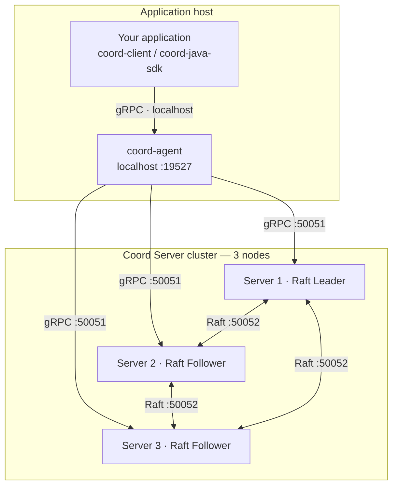

# Coord

<div align="center">

[](LICENSE)
[](rust-toolchain.toml)
[](coord-java-sdk/pom.xml)

**English** · [**简体中文**](README.zh-CN.md)

</div>

**Coord** is a distributed coordination service for microservice platforms. A small Raft-based server cluster provides strongly consistent primitives — key/value storage, atomic transactions, leases, change watches, authentication and encryption at rest. A `coord-agent` daemon runs on every application machine and turns those primitives into the higher-level coordination capabilities that business code actually needs.

> **Agent-first architecture.** Applications never connect to the Coord Server cluster directly. Each machine runs a `coord-agent`; applications connect to it over localhost gRPC (`127.0.0.1:19527`). The agent proxies the core server primitives under the same contract and hosts all higher-level coordination services locally — caching reads, fanning out watches, and keeping local capabilities available even when the cluster link is temporarily lost.

> **This project uses Deepseek V4 as an auxiliary development tool for learning and validation purposes, and is not intended for production use.**

## Why Coord?

If you already know etcd, Consul or ZooKeeper, think of Coord as two layers:

- **A consensus & storage substrate** — linearizable KV / Txn / Watch / Lease over Raft, similar in spirit to etcd, with auth, TLS/mTLS and encryption at rest.
- **A per-machine agent layer** — one `coord-agent` per host exposes service discovery, configuration, distributed locking, ID generation, leader election, events, caching, MQ, workflow, scheduling, rate limiting, feature flags and PKI issuance as local gRPC services under a single contract. Business code talks to one endpoint with one SDK and never deals with cluster topology.

The consistency core is independently exercised by an in-repo [Jepsen](https://github.com/jepsen-io/jepsen) suite (see [Verification](#verification)).

## Architecture


```mermaid
graph TD
    subgraph "Application host"
        APP[Your application<br/>coord-client / coord-java-sdk]
        AGENT[coord-agent<br/>localhost :19527]
    end
    subgraph "Coord Server cluster — 3 nodes"
        S1[Server 1 · Raft Leader]
        S2[Server 2 · Raft Follower]
        S3[Server 3 · Raft Follower]
    end

    APP -->|gRPC · localhost| AGENT
    AGENT -->|gRPC :50051| S1
    AGENT -->|gRPC :50051| S2
    AGENT -->|gRPC :50051| S3
    S1 <-->|Raft :50052| S2
    S2 <-->|Raft :50052| S3
    S3 <-->|Raft :50052| S1
```

Server ports `50051` / `50052` are reachable only by agents — the Server is never exposed to business applications.

## Highlights

**Server — consensus & storage substrate**

| Area | Notes |
|:---|:---|
| KV / Txn / Watch / Lease | Linearizable; Jepsen-verified across kill / pause / partition matrices |
| Auth / RBAC | Users, roles and permissions; Ed25519 CCT tokens; login rate limiting |
| TLS / mTLS | gRPC + Raft channels; refuses to start without a CA (fail-closed) |
| Encryption at rest | AES-256-GCM, plus Shamir secret-sharing Seal / Unseal |
| Operations | Snapshots, MVCC compaction, dynamic membership, Prometheus metrics |
| Multi-Raft (opt-in) | Region sharding across multiple Raft groups with an embedded placement driver; enable via `[multi_raft]` (see [`config.example.toml`](config.example.toml)) |

**Agent — the coordination layer your application talks to**

18 pluggable gRPC services, toggled per service via the `[services]` / `[plugins]` configuration sections:

- **Discovery & config:** `Registry` · `ConfigCenter` · `Event`
- **Coordination:** `Lock` · `IdGen` · `LeaderElection`
- **Data & messaging:** `Cache` · `Mq` · `Replica` (ISR replication for Cache/MQ)
- **Automation:** `Workflow` · `Scheduler` · `Policy` · `FeatureFlags`
- **Resilience & security:** `CircuitBreaker` · `RateLimiter` · `Transit` · `Pki`
- **Extensibility:** every service above is hosted as a **builtin plugin** by the plugin manager — one registry owns each service's lifecycle, gRPC surface and health. `Plugin` (`coord.plugin.Plugin`) exposes that unified service/plugin inventory (with per-service health), and loads external wasm/JS plugins when `[plugins]` is enabled (off by default)

Agent extras: core-proxy services (`coord.kv` / `coord.txn` / `coord.lease` / `coord.watch` / `coord.maintenance`) with the same contract as the Server, KV read caching, watch fan-out, and health checks + Prometheus metrics on `127.0.0.1:19528`.

## Quick start

**Prerequisites:** Rust 1.98.1 (pinned by `rust-toolchain.toml`); Java 21 + Maven 3.9+ and Node 22 + pnpm only if you use the Java SDK or the web UI.

```bash
cargo build                                # build all crates
cargo test --workspace --no-fail-fast      # run the full test suite
```

**Single-node dev mode** (server + agent on localhost):

```bash
cargo run -p coord -- dev --fresh
```

Server gRPC listens on `127.0.0.1:50051`; the agent on `127.0.0.1:19527`.

**Start a real cluster:**

```bash
# node 1 — bootstrap
cargo run -p coord -- server --bootstrap

# nodes 2 and 3 — join node 1
cargo run -p coord -- server --id 2 --join <node1-grpc-addr>
```

For production, copy [`config.example.toml`](config.example.toml) to each node — identical `auth_root_key` and `raft_shared_secret` everywhere, `bootstrap = true` on the first node only, `join_addr` on the others, and optional mTLS / encryption in the `security` section.

**Run an agent on every machine:**

```bash
cargo run -p coord -- agent --static-peers <server1>:50051,<server2>:50051
cargo run -p coord -- agent --agent-config agent.toml   # services / tls / auth / replication
```

**From your application** — connect to the local agent (see [`java-example/`](java-example/) for full samples):

```java
import cn.byteforce.coord.sdk.CoordClient;
import cn.byteforce.coord.sdk.CoordConfig;

CoordConfig config = CoordConfig.builder()
        .agentHost("127.0.0.1")
        .agentPort(19527)
        // Production: TLS is fail-closed (missing CA cert = refuse to connect)
        // .useTls(true).tlsCaCertPath("/etc/coord/ca.pem")
        // CCT credentials are read per call, so refresh needs no channel rebuild
        // .authTokenSupplier(() -> credentialStore.currentCct())
        .build();

try (CoordClient client = CoordClient.create(config)) {
    client.configClient().put("/app/config", "value");
    String val = client.configClient().getString("/app/config").orElse(null);

    client.registry().register("order-service", "inst-1", "{}", 30);
    var instances = client.registry().discover("order-service");
}
```

> The snippet above is the **real** SDK (`coord-java-sdk`, artifact group
> `cn.byteforce.coord`) — connect via `CoordClient.create(CoordConfig)`. The
> `java-example/` module is a **separate, self-contained** gRPC demo; its
> `cn.byteforce.coord.example.CoordClient` convenience wrapper is example-local
> and is **not** the SDK class.

Operations CLI: `coord member | snapshot | security | auth | capability | idgen | reset`.

## Project layout

```
coord/
├── coord/               # CLI (server / agent / dev + ops subcommands)
├── coord-proto/         # Protobuf / gRPC contracts
├── coord-core/          # Shared traits & types
├── coord-server/        # Server: Raft, MVCC, Txn, Watch, Lease, Auth, TLS
├── coord-agent/         # Agent daemon — the per-machine coordination layer
├── coord-client/        # Rust client SDK
├── coord-java-sdk/      # Java SDK (cn.byteforce:coord-java-sdk)
├── java-example/        # Java sample application
├── coord-ui/            # Web management UI (React 19 + Vite)
├── jepsen/              # In-repo Jepsen test project + lab
├── apis/contracts/      # Protocol contracts & capability commitments
├── deploy/              # docker-compose 3-node + Kubernetes StatefulSet
└── monitoring/          # Grafana dashboard + Prometheus rules
```

## Verification

- **Jepsen** — an in-repo Clojure project ([`jepsen/`](jepsen/README.md)) runs real 3-node clusters against a knossos linearizability checker: `register` / `cas-register` / `multi-register` workloads under kill / pause / partition nemeses, plus a 72-hour soak.
- **Fast local check** — `scripts/jepsen-check.sh` reproduces the core matrix in ~2–3 minutes without a lab.
- **CI** — fmt + clippy (`-D warnings`), a panic gate on non-test code, workspace tests, protobuf contract checks (buf breaking), `cargo audit` + `cargo deny`, and real-process chaos runs.

## Deploy

- **docker-compose:** 3-node cluster in [`deploy/docker-compose/`](deploy/docker-compose/README.md)
- **Kubernetes:** StatefulSet with probes & PDB in [`deploy/k8s/statefulset.yaml`](deploy/k8s/statefulset.yaml)
- **Monitoring:** Grafana dashboard + Prometheus rules in [`monitoring/`](monitoring/)
- **Web UI:** see [`coord-ui/README.md`](coord-ui/README.md)

## Status

Version `0.1.0` (pre-1.0); no tagged release has been published yet. The Raft engine (`openraft`) is an alpha dependency and Coord is **not yet recommended for production** — however, the core consistency and failure-recovery semantics are covered by the in-repo Jepsen matrix described above.

## Documentation

- Protocol contracts & capability commitments: [`apis/contracts/`](apis/contracts/README.md)
- Server configuration reference: [`config.example.toml`](config.example.toml)
- Vulnerability reporting: [`SECURITY.md`](SECURITY.md)

## Contributing

See [`CONTRIBUTING.md`](CONTRIBUTING.md) and [`CODE_OF_CONDUCT.md`](CODE_OF_CONDUCT.md).

## License

[MIT](LICENSE) © Byteforce Team
