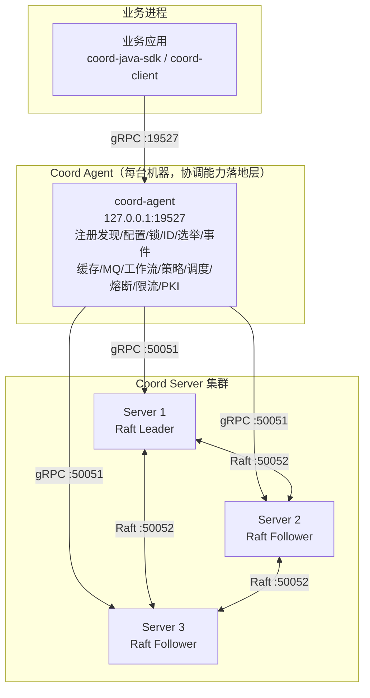

# Coord

<div align="center">

[](LICENSE)
[](rust-toolchain.toml)
[](coord-java-sdk/pom.xml)

</div>

**Coord** 是一个分布式协调服务：基于 Raft 共识协议提供强一致的 KV 存储、原子事务、租约、变更监听、鉴权等共识原语，并通过 `coord-agent` 向业务应用交付注册发现、配置中心、分布式锁、ID 生成、选举、事件通知、缓存、消息队列、工作流编排、策略引擎、调度、熔断、限流、特性开关与 PKI 证书签发等完整协调能力。 

- 当前项目使用 deepseek v4 辅助开发 用于评估 ai 辅助开发复杂项目能力 主要用于学习验证
- **Server（共识与存储基座）**：单 Raft 组 3 节点部署，提供 KV / Txn / Watch / Lease / Auth / 静态加密 / 快照 / 压缩等原语与 Prometheus 指标。gRPC（`50051`）与 Raft（`50052`）端口仅对 Agent 可达，**业务应用永不直连 Server 集群**。
- **Agent（应用唯一接入方式）**：每台业务机器部署 `coord-agent`，应用经本机 gRPC（`127.0.0.1:19527`）接入。Agent 代理 Server 核心原语，并在本机落地全部高级协调服务——**服务协调能力的真正承载层是 Agent**，Server 仅作为共识与存储基座。
- **对外契约**：`apis/contracts/` 以协议白皮书 + 承诺台账的形式向业务方承诺注册发现、分布式锁、Leader 选举、分布式 ID、事件通知五类能力（GA 期限 2026-10-31 至 2026-12-31）。
- **Multi-Raft/PD 分片**：已接入生产路径（region 目录级存储隔离 + 内嵌 PD 调度），**默认关闭（opt-in）**——需显式配置 `[multi_raft]` 启用（见 [`config.example.toml`](config.example.toml)）；能力边界与 v1 限制（Watch/Lease/快照/扩容等）见 [`docs/multi-raft-limits.md`](docs/multi-raft-limits.md)。**Cache/MQ ISR 复制**已实现但默认关闭，未接入生产路径。

> **成熟度**：核心一致性与故障恢复已通过 Jepsen 全矩阵验证（2026-08-29，见下节），72 小时浸泡测试进行中（2026-08-30 启动）；共识依赖 `openraft` 仍为 alpha 版本，整体**尚未生产就绪**，不建议直接用于生产环境。

## Jepsen 一致性验证

Coord 的一致性与故障恢复能力由**仓库内 Jepsen 测试工程**（[`jepsen/`](jepsen/README.md)，
Clojure/lein，源码随 coord 一起版本化——checkout 任意 commit 即得到配套测试）在**仓库内
Jepsen lab**（[`jepsen/lab/`](jepsen/lab/README.md)，clone coord 即可自建，Vagrant/Docker
双 provider）上执行验证：3 节点真实集群 + 自研 gRPC 客户端 + knossos 线性一致性检查器，
工作负载 register / cas-register / multi-register（多 Region），nemesis kill / pause /
partition 全矩阵与 72h soak。仓库内另有 Rust 等价快速收口 `scripts/jepsen-check.sh`
（无需 lab，约 2–3 分钟）。

| 判据 | 结果 |
|:---|:---|
| 线性一致性（none / kill / kill-all / pause / partition / partition-halves / partition-ring 全矩阵） | **通过，0 异常** |
| 持久性（kill -9 + 重启后读回一致） | 通过 |
| 无脑裂（分区期间至多一个分区可写） | 通过 |
| 快速失败（无 quorum 时写 ≤5s 失败，不无限挂起） | 通过 |

**发现并修复了一个真实缺陷（网络分区下的间歇性陈旧读）**：验证期间曾稳定复现「已确认提交的写之后，读返回更旧的值」。根因不在读路径，而在集群成员地址通告——bootstrap 节点将绑定地址 `0.0.0.0:50052` 通告为自身 Raft 地址，对端节点按该地址连接时落到各自本机、把本机应答当作对端应答，形成**自我应答的伪多数派**，在无真实 quorum 的情况下提交并 apply 日志。修复：

- 节点通告地址优先取 `initial_nodes` 中解析后的可路由地址，仅配置缺失时才回退到绑定地址（`coord/src/main.rs`）；
- 读路径追加防御性一致性复核：ReadIndex 之后校验 Leader 状态、`applied ≤ committed` 与本地日志条目一致，不满足即返回 UNAVAILABLE——**宁可失败也不返回过期值**（`coord-server/src/server/mod.rs`）。

修复后高负载档位（约 5–10 ops/s）下 partition-halves 3/3、partition-ring 2/2 复测通过，完整回归矩阵 0 异常。

**72 小时浸泡（soak）**：修复后二进制自 2026-08-30 起在 3 节点集群上运行 72h 浸泡——固定速率读写（0.5 ops/s，全程约 13 万操作）+ 慢速轮转故障注入（kill / pause / 单节点 partition）+ 专用 O(n log n) 线性一致性检查器（伪造值 / 未来值 / 陈旧读三类违规 + 收敛校验）。浸泡期间配套修复：

- 测试客户端鉴权令牌（1h TTL）过期后不重认证的问题——客户端现已支持自动重认证重试；
- Server 在非 Leader 节点收到 Auth 写入时错误映射为 INTERNAL 的问题——现与 KV 写路径同口径返回 UNAVAILABLE 并附 Leader 提示（`coord-server/src/auth/service.rs`）。

> 截至 2026-08-30 运行中（约 12 小时 / 72 小时），读写正常、检查器无异常输出；浸泡结束后结果在此收口。

---

## 架构概览


```mermaid
graph TD
    subgraph "业务进程"
        APP[业务应用<br/>coord-java-sdk / coord-client]
    end

    subgraph "Coord Agent（每台机器，协调能力落地层）"
        AGENT[coord-agent<br/>127.0.0.1:19527<br/>注册发现/配置/锁/ID/选举/事件<br/>缓存/MQ/工作流/策略/调度/熔断/限流/PKI]
    end

    subgraph "Coord Server 集群"
        S1[Server 1<br/>Raft Leader]
        S2[Server 2<br/>Raft Follower]
        S3[Server 3<br/>Raft Follower]
    end

    APP -->|gRPC :19527| AGENT
    AGENT -->|gRPC :50051| S1
    AGENT -->|gRPC :50051| S2
    AGENT -->|gRPC :50051| S3
    S1 <-->|Raft :50052| S2
    S1 <-->|Raft :50052| S3
    S2 <-->|Raft :50052| S3
```

> 生产拓扑：业务应用只访问本机 Agent；Server 集群的 `50051`/`50052` 端口仅对 Agent 网络可达，不直接向应用暴露。

## 核心特性

> 状态口径：✅ = 已实现且有自动化测试覆盖；⚠️ = 存在已知限制/默认关闭（opt-in）；🧪 = experimental（未接入生产路径）。
>
> 分工口径：共识基座由 **Server** 提供、经 Agent 代理透出；高级协调能力全部由 **Agent** 落地（Server 仅作为其 KV/Lease/Watch 存储后端）。
>
> 验证口径：KV / Txn / Watch / Lease 读写的线性一致性已通过独立 Jepsen 工程全矩阵验证（见「Jepsen 一致性验证」）。

### Server：共识与存储基座

| 能力 | 描述 | 状态 |
|:---|:---|:---:|
| **KV** | Put/Get/Delete/Range，半开区间 `[key, range_end)` 语义、历史 revision 读、软删除过滤 | ✅ |
| **Txn** | Compare-And-Swap 原子事务，多操作原子提交 | ✅ |
| **Watch** | Key 变更监听，前缀匹配、历史回放 | ✅ |
| **Lease** | Grant/Revoke/KeepAlive，Key 绑定自动过期 | ✅ |
| **Auth/RBAC** | 用户/角色/权限，scope 级 RBAC，Ed25519 CCT 令牌签发，登录限流 | ✅ |
| **TLS/mTLS** | gRPC 与 Raft 通道加密，raft 端口共享密钥 HMAC，缺 CA 拒绝启动（fail-closed） | ✅ |
| **Barrier** | AES-256-GCM 静止数据加密（`encryption_enabled` 开关，仅加密 `/kv/` 用户数据，默认关闭） | ✅ |
| **Seal/Unseal** | Shamir Secret Sharing 密钥分片（默认 5 分片 / 3 门限）+ root 密钥模式 | ✅ |
| **Compaction** | MVCC 版本自动压缩 | ✅ |
| **Snapshot** | 单事务导出、2MiB 分块流式传输、auth/lease/compacted 入快照 | ✅ |
| **可观测性** | Prometheus 指标（watch/apply/txn/snapshot/compaction/auth/storage）+ `/healthz` | ✅ |
| **Multi-Raft/PD** | Region 分片（目录级隔离，多 Raft 组）+ 内嵌 PD 调度 | ⚠️ 默认关闭 opt-in，生产可用待验证完成后确认（边界见 [`docs/multi-raft-limits.md`](docs/multi-raft-limits.md)） |

> KV / Txn / Watch / Lease 的线性一致性与故障恢复（kill/kill-all/pause/partition/partition-halves/partition-ring）已通过 Jepsen 验证。

### Agent：高级协调能力落地层（`coord.agent.*` gRPC 服务）

| 服务 | gRPC | 能力 | 后端依赖 | 默认 |
|:---|:---|:---|:---|:---:|
| **Registry** | `coord.agent.Registry` | 服务注册/发现：Lease 绑定自动过期、实例 TCP 探测、本地缓存、Watch 增量推送与跨节点回灌 | Server KV/Lease/Watch | 开 |
| **ConfigCenter** | `coord.agent.Config` | 配置读写 + Watch 热更新，断连时回退本地最后快照 | Server KV/Watch | 开 |
| **Lock** | `coord.agent.Lock` | 分布式锁：Lease + Txn 实现，续期刷新 + FIFO 公平等待队列 | Server KV/Lease/Txn | 开 |
| **IdGen** | `coord.agent.IdGen` | 全局 ID：雪花（1+41+10+12 布局，离线可用，nodeid CAS 注册防冲突）/ 号段（Server Txn CAS，opt-in） | 雪花无依赖 | 开 |
| **Workflow** | `coord.agent.Workflow` | coord-core 引擎：定义版本化部署、实例状态机、Saga 补偿、重试、HTTP 任务分派、调度（every/cron/after/on） | Server KV 持久化 | 开 |
| **Policy** | `coord.agent.Policy` | 本地 RBAC/ABAC 决策 + OPA（Regorus）bundle 通道、explain | Server KV（bundle） | 开 |
| **Transit** | `coord.agent.Transit` | 信封加密：AES-256-GCM、DEK/KEK、重包裹轮换、HMAC 签名 | 无 | 开 |
| **PKI** | `coord.agent.Pki` | CA 签发：get-or-create、续期/轮换，多 Agent 共享同一 CA 根 | Server KV（共享 store） | 开 |
| **Cache** | `coord.agent.Cache` | redb 本地持久化缓存：String/Hash/List/Set + TTL、原子 pop；可选 ISR 复制 | 无（复制走对端 Agent） | 开 |
| **MQ** | `coord.agent.Mq` | Topic/Partition/ConsumerGroup/DLQ，poll+ack 至少一次、长轮询订阅；可选 ISR 复制 | 无（复制走对端 Agent） | 关 |
| **LeaderElection** | `coord.agent.LeaderElection` | 分组选举：Leader 持 Lease、Follower Watch 继任、多组支持 | Server KV/Lease/Watch | 关 |
| **Event** | `coord.agent.Event` | 事件发布/订阅：Server KV 持久化 + gRPC 订阅流 + CloudEvents 封装 | Server KV | 关 |
| **Scheduler** | `coord.agent.Scheduler` | 任务 claim + 心跳续租、Exactly-Once 状态机、随机退避防惊群 | 无 | 关 |
| **CircuitBreaker** | `coord.agent.CircuitBreaker` | Closed/Open/HalfOpen 状态机，阈值 + 探测恢复 | 无 | 关 |
| **RateLimiter** | `coord.agent.RateLimiter` | 令牌桶限流（`max_tokens` + `refill_rate`） | 无 | 关 |
| **FeatureFlags** | `coord.agent.FeatureFlags` | 布尔开关 + 百分比灰度（用户 ID 一致性哈希分桶） | 无 | 关 |
| **ISR Replication** | `coord.agent.Replica` | Cache/MQ 跨 Agent 同步复制：min_isr 门控、幂等应用、Reconcile 落后追赶、双向心跳 | 对端 Agent | 关 |

> 「默认」列 = `[services]` 段缺省值；关闭的服务不分配任何资源。⚠️ ISR 复制已实现且有双 Agent 集成测试覆盖，但静态分区 Leader、无故障转移演练，未接入生产路径。

## 对外契约

`apis/contracts/` 定义 Coord 对上游业务方（100+ 微服务，Java/Go）的协调能力承诺，以协议白皮书 + 机器可读台账管理，CI 硬卡口约束，逾期未兑现即红牌：

| 层级 | 内容 | 状态 |
|:---|:---|:---|
| 底座原语 | KV / Txn / Lease / Watch / Maintenance.Status / Health | STABLE，受 buf breaking + wire-sync 卡口保护 |
| 能力承诺面 | 注册发现、分布式锁、Leader 选举、分布式 ID、事件通知（`coord.{registry,lock,election,idgen,event}.v1`） | COMMITTED，GA 期限 2026-10-31 至 2026-12-31 |
| 承诺修复区 | Cache / MQ / Workflow / Scheduler | EXPERIMENTAL，缺陷清单与整改期限见 `STATUS.md` |

语义契约全文在 proto 注释中；接入方式与消费说明见 [`apis/contracts/README.md`](apis/contracts/README.md)。

## coord-agent：应用接入入口与协调能力落地层

> **生产拓扑**：业务应用**只连接本机 Agent**（`127.0.0.1:19527`），Server 集群的 `50051`/`50052` 端口对业务网络不可见。应用感知到的所有协调原语（锁、注册发现、配置、ID、缓存、MQ、工作流……）都在 Agent 进程内落地，Server 仅作为其共识与存储基座。

### 服务面

- **核心代理服务**：`coord.kv` / `coord.txn` / `coord.lease` / `coord.watch` / `coord.maintenance`——与 Server 同名同契约，应用无需感知集群位置与 Leader 拓扑；
- **高级协调服务**：17 个 `coord.agent.*` 服务（见上表），由 `[services]` 段按需开关；
- **gRPC 基础设施**：标准 `grpc.health.v1.Health`、自定义 `coord.agent.Health`（Java SDK `healthCheck()` 调用）、Server Reflection。

### 请求路径与本地加速

- 转发层以 Direct 模式连接 Server 集群，复用 `coord-client` 的 Leader 发现、连接池与重试；启动指数退避重试（最多 30s），超时进入**骨架模式**（核心代理返回占位响应，本地服务照常可用）；
- **KV 读缓存**：单键 Range 命中本地 LRU（默认 1 万条 / 30s TTL），写/删主动失效；
- **Watch Fan-out**：同前缀多订阅者共享一条到 Server 的 Watch 流，本地扇出（带指标）；
- 语义错误（`not leader` 等）原样透出，内部错误对客户端脱敏。

### 安全（fail-closed）

- 绑定非 loopback 地址必须同时启用 `[auth]` + `[tls]`，否则拒绝启动；
- 入站 TLS 证书/私钥加载失败即拒绝启动；配置 `tls.ca_path` 时强制 mTLS；
- `[auth]`：所有 RPC 校验 CCT 令牌（HMAC 历史方案兼容 + Ed25519 公钥验证，Agent 仅存公钥、被控不可伪造）+ capability 检查，未命中 RPC 一律拒绝；默认关闭（仅限本机开发）；
- ISR 复制存在非 loopback 对端时强制 TLS（明文复制仅限 loopback）。

### 可观测性

- HTTP `127.0.0.1:19528`：`/health`、`/health?ready=true`（每 5s TCP 探测全部 Server 对端、实时回写，非启动快照）、`/metrics`（Prometheus）；
- gRPC 请求计数中间件 + 连接状态指标（`coord_agent_connected`）。

### 配置

`coord agent --agent-config agent.toml`：基础参数（`agent_addr`/`http_addr`/`static_peers`/`data_dir`）+ `[services]`（默认开：registry/config_center/lock/idgen/cache/workflow/policy/transit/pki；默认关：leader_election/event_notification/mq/scheduler/circuit_breaker/rate_limiter/feature_flags/replication）+ `[auth]`/`[tls]`/`[replication]`/`[thread_pools]`。CLI 显式参数覆盖配置文件同名字段。

## 项目结构

```
coord/
├── coord/              # CLI 二进制（server/agent/dev + 运维子命令）
├── coord-proto/        # Protobuf/gRPC 契约（9 个 proto 文件）
├── coord-core/         # 公共 Trait 与类型
├── coord-server/       # 服务端实现（Raft/MVCC/Txn/Watch/Lease/Auth/TLS）
├── coord-agent/        # Agent 守护进程（应用唯一接入入口：5 大核心服务代理 + 17 个可插拔协调服务）
├── coord-client/       # Rust 客户端 SDK（gRPC + Leader 发现 + 重试）
├── coord-macros/       # 派生宏
├── coord-test/         # 测试工具
├── coord-java-sdk/     # Java SDK（cn.byteforce:coord-java-sdk）
├── java-example/       # Java 接入示例
├── coord-ui/           # Web 管理界面（React 19 + Vite + Tailwind 4）
├── jepsen/             # Jepsen 测试工程（Clojure/lein，随 coord 版本化；含仓内 lab jepsen/lab/）
├── apis/contracts/     # 对外契约：底座原语 + 能力承诺面（registry/lock/election/idgen/event）+ 白皮书/台账
├── deploy/             # docker-compose 三节点 + k8s StatefulSet
├── monitoring/         # Grafana 面板 + Prometheus 告警规则
├── scripts/            # 门禁与基准脚本（check-panics/jepsen/soak/bench）
├── config.example.toml # 服务端生产配置模板
└── Dockerfile          # 多阶段镜像（coord-ui + Rust）
```

## 快速开始

### 前置条件

- Rust 1.93.0（由 `rust-toolchain.toml` 固定）
- Java 21 + Maven 3.9+（仅 Java SDK / 示例）
- Node 22 + pnpm（仅 `coord-ui`）

### 构建

```bash
cargo build                        # 构建全部 Rust Crate
cargo test --workspace --no-fail-fast   # 全量测试
cargo build --release              # 发布构建
```

### 开发模式（单节点 Server + Agent）

```bash
cargo run -p coord -- dev --fresh
```

- Server gRPC 监听 `127.0.0.1:50051`，Agent 监听 `127.0.0.1:19527`；
- 绑定非 loopback 地址（容器化调试）须显式传 `--allow-insecure`；
- 数据落在 `coord-dev-data/`（已 gitignore）。

### 启动 Server

```bash
# 单节点
cargo run -p coord -- server --bootstrap

# 加入已有集群
cargo run -p coord -- server --id 2 --join <leader-grpc-addr>
```

生产集群请使用 [`config.example.toml`](config.example.toml)：三节点各复制一份，配置相同的 `auth_root_key` 与 `raft_shared_secret`，首节点 `bootstrap = true`，其余节点填 `join_addr`；`security` 段支持 mTLS 证书与静态加密开关（占位默认值会被启动校验拒绝）。

### 启动 Agent

```bash
cargo run -p coord -- agent                       # 默认 127.0.0.1:19527
cargo run -p coord -- agent --static-peers 192.168.1.10:50051,192.168.1.11:50051
cargo run -p coord -- agent --agent-config agent.toml   # 生产配置（[services]/[tls]/[auth]/[replication]）
```

`--agent-config` 加载 TOML 配置：`[services]` 控制 17 个高级协调服务的开关，`[tls]`/`[auth]`/`[replication]` 分别控制传输加密、CCT 鉴权与 ISR 复制。生产环境业务应用只连本机 Agent，Server 集群端口仅对 Agent 开放；能力清单与安全策略见上文「coord-agent」一节。

### 运维子命令

```bash
coord member      # 动态成员管理（add/remove）
coord snapshot    # 快照管理
coord security    # Seal/Unseal/密钥分片初始化
coord auth        # 用户/角色/权限管理
coord capability  # 能力注册中心查询
coord idgen       # ID 生成器运维
coord reset       # 清空本地数据目录
```

### Java 应用接入

```xml
<dependency>
    <groupId>cn.byteforce</groupId>
    <artifactId>coord-java-sdk</artifactId>
    <version>1.0.0-SNAPSHOT</version>
</dependency>
```

SDK 通过 gRPC 连接本机 Agent（`127.0.0.1:19527`），提供 `registry` / `config` / `lock` / `mq` / `cache` / `idgen` / `workflow` / `policy` / `pki` 等包，示例见 [`java-example/`](java-example/)（CoordClient、ServiceRegistry、ConfigClient）。SDK 测试：`mvn -f coord-java-sdk/pom.xml test`（含连真实 Agent 的集成测试）。

### Web 管理界面

```bash
cd coord-ui
pnpm install
pnpm dev       # 开发服务器
pnpm build     # 构建
pnpm lint      # oxlint
pnpm test      # vitest 单测
pnpm test:e2e  # playwright e2e（auth/config/registry）
```

## 部署

- **docker-compose**：见 [`deploy/docker-compose/`](deploy/docker-compose/)，三节点集群（mTLS + 共享密钥），`certs/gen-certs.sh` 生成测试证书，使用说明见 [deploy/docker-compose/README.md](deploy/docker-compose/README.md)；
- **Kubernetes**：见 [`deploy/k8s/statefulset.yaml`](deploy/k8s/statefulset.yaml)（StatefulSet，含 secrets、readiness/liveness 探针、PDB）；
- **监控**：`monitoring/grafana-dashboard.json` 与 `monitoring/prometheus-rules.yml`（抓取配置待补）；
- **镜像**：[`Dockerfile`](Dockerfile) 多阶段构建（Node 22 构建 UI + Rust 1.93 构建二进制 + 非 root 运行）；发布流程见 `.github/workflows/release.yml`（`v*` tag → linux x86_64/aarch64 二进制 + ghcr 镜像，**尚未演练**）。

## 质量保障

- **一致性验证**：独立 Jepsen 工程全矩阵 + 72h 浸泡（见「Jepsen 一致性验证」）；仓库内等价快速收口 `scripts/jepsen-check.sh`（真实 3 进程集群 kill -9 / 暂停 / TCP 代理分区 + 线性一致性检查器，约 2–3 分钟）；
- **长跑与基准**：`scripts/soak-72h.sh`（72h 浸泡）、`scripts/bench-ci.sh` / `scripts/bench-release.sh`（周度/发布基准）；
- **CI（`.github/workflows/ci.yml`）**：fmt + clippy（`-D warnings`）+ panic 卡口（非测试目标 unwrap/expect/panic 计数 = 0）、前端 lint/build、proto contract（buf lint + breaking）、workspace 测试、cargo audit + cargo deny、真实进程 chaos（夜间/手动）、周度性能基线；另有 `contract-check.yml`（承诺期限卡口）与 `release.yml`（tag 触发）；
- 全量 workspace 测试（2026-08-30 实测）：**75 个测试目标、1656 通过 / 0 失败 / 22 ignored**；
- 已知待办：Java SDK 测试与 UI 单测/e2e 尚未接入 CI；第三方审计与 kind 部署演练尚未执行。

## 技术栈

| 组件 | 技术选型 | 版本 |
|:---|:---|:---|
| 语言 | Rust | 1.93.0 |
| 异步运行时 | Tokio | 1.49 |
| gRPC 框架 | Tonic + Prost | 0.14.6 / 0.14.3 |
| Raft 共识 | Openraft | 0.10.0-alpha.34（alpha 版本） |
| 存储引擎 | Redb | 4.1.0 |
| HTTP 层 | Axum | 0.8 |
| CLI | Clap | 4 |
| Java SDK | Java + gRPC-Java + protobuf-java | 21 / 1.68 / 4.28 |
| 前端 | React + Vite + TypeScript + Tailwind CSS | 19.2 / 8.1 / 6.0 / 4.3 |
| UI 测试 | Vitest + Playwright | — |

## 安全

- 安全特性：TLS/mTLS（缺 CA 拒绝启动）、CCT 令牌鉴权（Ed25519 + HMAC 兼容）、scope 级 RBAC、AES-256-GCM 静态加密、Shamir 分片 Seal/Unseal——详见上表与 `coord-agent` 安全小节；
- 漏洞报告渠道见 [`SECURITY.md`](SECURITY.md)（当前为邮件联系维护者，无 SLA）；
- 依赖审计：`cargo audit` + `cargo deny --check deny.toml`（CI 已接入）。

## 版本

仓库版本 `0.1.0`，尚未发布任何 tag。近期里程碑：

- 2026-08-29：Jepsen 全矩阵验证通过，修复网络分区下的间歇性陈旧读（bootstrap 地址通告缺陷）；
- 2026-08-30：72h 浸泡启动；修复鉴权写请求在非 Leader 节点的错误映射。

发布流程见 `.github/workflows/release.yml`（tag 触发）。

## 参与贡献

见 [`CONTRIBUTING.md`](CONTRIBUTING.md) 与 [`CODE_OF_CONDUCT.md`](CODE_OF_CONDUCT.md)。

## 许可

本项目采用 [MIT License](LICENSE)。
