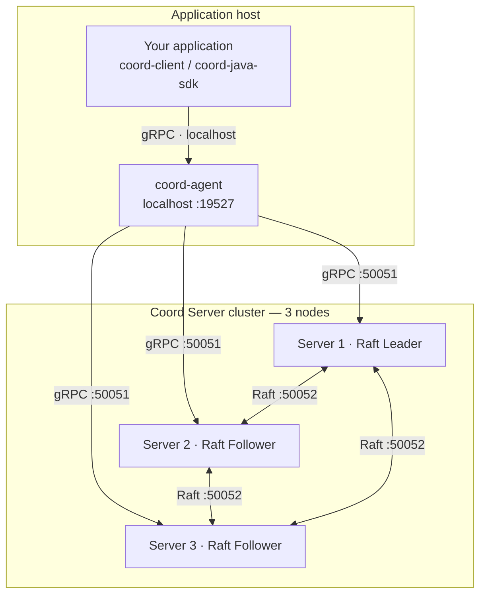

# Coord

<div align="center">

[](LICENSE)
[](rust-toolchain.toml)
[](coord-java-sdk/pom.xml)

**English** · [**简体中文**](README.zh-CN.md)

</div>

**Coord** is a distributed coordination service for microservice platforms. A small Raft-based server cluster provides strongly consistent primitives — key/value storage, atomic transactions, leases, change watches, authentication and encryption at rest. A `coord-agent` daemon runs on every application machine and turns those primitives into the higher-level coordination capabilities that business code actually needs.

> **Agent-first architecture.** Applications never connect to the Coord Server cluster directly. Each machine runs a `coord-agent`; applications connect to it over localhost gRPC (`127.0.0.1:19527`). The agent proxies the core server primitives under the same contract and hosts all higher-level coordination services locally — caching reads, fanning out watches, and keeping local capabilities available even when the cluster link is temporarily lost.

> **Development disclosure & commitment level.** This project uses Deepseek V4 as an
> auxiliary development tool for learning and validation purposes. **The interface commitment
> (L0) is usable**: the protocol contracts under [`apis/contracts/`](apis/contracts/README.md)
> are frozen, versioned and validated by CI gates. **Production readiness is not claimed** —
> the production surface and its acceptance gates live in
> [`apis/contracts/WHITEPAPER.md`](apis/contracts/WHITEPAPER.md) §12 and
> [`docs/production/production-readiness-plan-2026-09-21.md`](docs/production/production-readiness-plan-2026-09-21.md) §4.
>
> *(Adjudicated 2026-09-21: this replaces the former blanket "not intended for production use",
> which was mutually exclusive with the contractual commitments below — see the plan's §8 U-01.)*

## Why Coord?

If you already know etcd, Consul or ZooKeeper, think of Coord as two layers:

- **A consensus & storage substrate** — linearizable KV / Txn / Watch / Lease over Raft, similar in spirit to etcd, with auth, TLS/mTLS and encryption at rest.
- **A per-machine agent layer** — one `coord-agent` per host exposes service discovery, configuration, distributed locking, ID generation, leader election, events, caching, MQ, workflow, scheduling, rate limiting, feature flags and PKI issuance as local gRPC services under a single contract. Business code talks to one endpoint with one SDK and never deals with cluster topology.

The consistency core is exercised by an in-repo [Jepsen](https://github.com/jepsen-io/jepsen) suite, **whose run artifacts are committed** under [`docs/production/evidence/`](docs/production/evidence/README.md) — see [Verification](#verification) for what that does and does not certify.

## Architecture


```mermaid
graph TD
    subgraph "Application host"
        APP[Your application<br/>coord-client / coord-java-sdk]
        AGENT[coord-agent<br/>localhost :19527]
    end
    subgraph "Coord Server cluster — 3 nodes"
        S1[Server 1 · Raft Leader]
        S2[Server 2 · Raft Follower]
        S3[Server 3 · Raft Follower]
    end

    APP -->|gRPC · localhost| AGENT
    AGENT -->|gRPC :50051| S1
    AGENT -->|gRPC :50051| S2
    AGENT -->|gRPC :50051| S3
    S1 <-->|Raft :50052| S2
    S2 <-->|Raft :50052| S3
    S3 <-->|Raft :50052| S1
```

Server ports `50051` / `50052` are reachable only by agents — the Server is never exposed to business applications.

## Highlights

**Server — consensus & storage substrate**

| Area | Notes |
|:---|:---|
| KV / Txn / Watch / Lease | Linearizable reads/writes within a Region; `jepsen/` contains a real knossos-based project (see [Verification](#verification) for what is and is not yet certified) |
| Auth / RBAC | Users, roles and permissions; Ed25519 CCT tokens; login rate limiting |
| TLS / mTLS | gRPC + Raft channels. **Not fail-closed**: `cargo run -p coord -- dev` / an auth-enabled cluster with a `raft_shared_secret` still starts over plaintext. Startup is refused only when (a) auth is disabled **and** the bind address is non-loopback, or (b) the Raft port is non-loopback with neither Raft mTLS nor `raft_shared_secret`. Configure `[tls]` explicitly for production |
| Encryption at rest | AES-256-GCM, plus Shamir secret-sharing Seal / Unseal |
| Operations | Snapshots, MVCC compaction, dynamic membership, Prometheus metrics |
| Multi-Raft (opt-in) | Region sharding across multiple Raft groups with an embedded placement driver; enable via `[multi_raft]` (see [`config.example.toml`](config.example.toml)) |

**Agent — the coordination layer your application talks to**

17 builtin gRPC services, toggled per service via the `[services]` / `[plugins]` configuration sections
(the plugin engine's own `Plugin` management service — `Invoke` / `List` — is not a builtin plugin; it is the gateway those plugins are exposed through):

- **Discovery & config:** `Registry` · `ConfigCenter` · `Event`
- **Coordination:** `Lock` · `IdGen` · `LeaderElection`
- **Data & messaging:** `Cache` · `Mq` · `Replica` (ISR replication for Cache/MQ)
- **Automation:** `Workflow` · `Scheduler` · `Policy` · `FeatureFlags`
- **Resilience & security:** `CircuitBreaker` · `RateLimiter` · `Transit` · `Pki`
- **Extensibility:** every service above is hosted as a **builtin plugin** by the plugin manager — one registry owns each service's lifecycle, gRPC surface and health. `Plugin` (`coord.plugin.Plugin`) exposes that unified service/plugin inventory (with per-service health), and loads external wasm/JS plugins when `[plugins]` is enabled (off by default)

> **Stability labels.** Per [`apis/contracts/STATUS.md`](apis/contracts/STATUS.md) — the single
> source of truth, parsed by CI — **all these services are `COMMITTED`**, i.e. the 16
> `coord.<domain>.v1` packages plus object storage (`coord.storage`), 17 ledger rows in total.
> The `EXPERIMENTAL` ledger zone was **emptied** in `contracts/v1.2.0` (2026-09-19): the four
> `coord.experimental.*` packages never had proto files or consumers, so no experimental
> package is open in any form. Object storage (`coord.storage`, also `COMMITTED`) is a
> Server-side data plane reached through the agent's storage proxy.
>
> **`COMMITTED` is an interface commitment, not a production-readiness claim.** The deadlines
> (2026-10-31 / 2026-11-30 / 2026-12-31, plus 2027-03-31 for `Workflow` and `Scheduler`) are
> interface-freeze deadlines; production readiness is a separate, stricter bar tracked as gates
> P1–P9 in [`docs/production/production-readiness-plan-2026-09-21.md`](docs/production/production-readiness-plan-2026-09-21.md) §4.
>
> Treat this list as an inventory, not as a support matrix.

Agent extras: core-proxy services (`coord.kv` / `coord.txn` / `coord.lease` / `coord.watch` / `coord.maintenance`) with the same contract as the Server, KV read caching, watch fan-out, and health checks + Prometheus metrics on `127.0.0.1:19528`.

## Quick start

**Prerequisites:** Rust 1.98.1 (pinned by `rust-toolchain.toml`); Java 21 + Maven 3.9+ and Node 22 + pnpm only if you use the Java SDK or the web UI.

```bash
cargo build                                # build all crates
cargo test --workspace --no-fail-fast      # run the full test suite
```

**Single-node dev mode** (server + agent on localhost):

```bash
cargo run -p coord -- dev --fresh
```

Server gRPC listens on `127.0.0.1:50051`; the agent on `127.0.0.1:19527`.

**Start a real cluster:**

```bash
# node 1 — bootstrap
cargo run -p coord -- server --bootstrap

# nodes 2 and 3 — join node 1
cargo run -p coord -- server --id 2 --join <node1-grpc-addr>
```

For production, copy [`config.example.toml`](config.example.toml) to each node — identical `auth_root_key` and `raft_shared_secret` everywhere, `bootstrap = true` on the first node only, `join_addr` on the others, and optional mTLS / encryption in the `security` section.

**Run an agent on every machine:**

```bash
cargo run -p coord -- agent --static-peers <server1>:50051,<server2>:50051
cargo run -p coord -- agent --agent-config agent.toml   # services / tls / auth / replication
```

**From your application** — connect to the local agent. `java-example/` is a separate,
self-contained gRPC demo (it does **not** use this SDK and has no README of its own); the
snippet below is the SDK's own API:

```java
import cn.byteforce.coord.sdk.CoordClient;
import cn.byteforce.coord.sdk.CoordConfig;

CoordConfig config = CoordConfig.builder()
        .agentHost("127.0.0.1")
        .agentPort(19527)
        // Production: configure TLS explicitly — it is NOT fail-closed (see the
        // capability table above). Without the lines below the channel is plaintext.
        // .useTls(true).tlsCaCertPath("/etc/coord/ca.pem")
        // CCT credentials are read per call, so refresh needs no channel rebuild
        // .authTokenSupplier(() -> credentialStore.currentCct())
        .build();

try (CoordClient client = CoordClient.create(config)) {
    client.configClient().put("/app/config", "value");
    String val = client.configClient().getString("/app/config").orElse(null);

    client.registry().register("order-service", "inst-1", "{}", 30);
    var instances = client.registry().discover("order-service");
}
```

> The snippet above is the **real** SDK (`coord-java-sdk`, Maven group `cn.byteforce`,
> artifact `coord-java-sdk`) — connect via `CoordClient.create(CoordConfig)`. The SDK is
> versioned `0.2.0` and is **not published to any repository**: run
> `mvn -pl coord-java-sdk install` in this repo first. The `java-example/` module is a
> **separate, self-contained** gRPC demo; its
> `cn.byteforce.coord.example.CoordClient` convenience wrapper is example-local
> and is **not** the SDK class.

> **Spring Boot adopters: there is no `coord-spring-boot-starter`, and that is a decision.**
> The auto-configuration module was removed and will not be restored — `coord-java-sdk` is the
> supported integration surface. You wire it yourself, which is two things:
>
> ```java
> @Bean(destroyMethod = "close")   // CoordClient is Closeable; this is the lifecycle hook
> CoordClient coordClient(CoordConfig config) { return CoordClient.create(config); }
> ```
>
> `close()` matters: it cancels pending watches and MQ subscriptions and shuts the client's
> pools down. If you never call it, they are only cancelled when the process exits (there is
> no shutdown hook). The SDK is what we test — 149 unit/contract tests plus
> `CoordClientIntegrationTest` against a real server + agent in CI (`mvn -Pit`) — so if the
> SDK does not work for you, that is a bug we want, not something you should work around.

Operations CLI: `coord member | snapshot | security | auth | capability | idgen | reset`.

## Project layout

```
coord/
├── coord/               # CLI (server / agent / dev + ops subcommands)
├── coord-proto/         # Protobuf / gRPC contracts
├── coord-core/          # Shared traits & types
├── coord-server/        # Server: Raft, MVCC, Txn, Watch, Lease, Auth, TLS
├── coord-agent/         # Agent daemon — the per-machine coordination layer
├── coord-client/        # Rust client SDK
├── coord-java-sdk/      # Java SDK (cn.byteforce:coord-java-sdk)
├── java-example/        # Java sample application
├── coord-ui/            # Web management UI (React 19 + Vite)
├── jepsen/              # In-repo Jepsen test project + lab
├── apis/contracts/      # Protocol contracts & capability commitments
├── deploy/              # docker-compose 3-node + Kubernetes StatefulSet
└── monitoring/          # Grafana dashboard + Prometheus rules
```

## Verification

- **Jepsen (in-repo)** — [`jepsen/`](jepsen/README.md) is a real Clojure + knossos project with `register` / `cas-register` / `multi-register` workloads under kill / pause / partition nemeses, plus a long-running soak profile documented in [`jepsen/README.md`](jepsen/README.md). **Run artifacts are committed**: [`docs/production/evidence/`](docs/production/evidence/README.md) holds 28 archived Jepsen/soak runs (each with `MANIFEST.md` + `sha256sums.txt`) plus the Java integration run, each with a `MANIFEST.md` recording the commit, the exact command and whether the tree was dirty. Note that every archived manifest records a **dirty** worktree and the parameter confirmation is not fully signed, so these runs document behaviour on pre-commit trees and are **not acceptance-grade evidence** — see [`docs/production/production-readiness-plan-2026-09-21.md`](docs/production/production-readiness-plan-2026-09-21.md) §2.3. Certification status of each finding is tracked per-finding in [`jepsen/docs/coord-findings.md`](jepsen/docs/coord-findings.md) — read the findings there rather than inferring a blanket linearizability guarantee.
- **Fast local check** — `scripts/jepsen-check.sh` runs **one** linearizability smoke test (`chaos_real_kill9_and_linearizability`) in ~2–3 minutes on a warm build; it is **not** a Jepsen run and does **not** reproduce the workload × nemesis matrix.
- **CI** — see [`.github/workflows/ci.yml`](.github/workflows/ci.yml) for the authoritative list: fmt + clippy (`-D warnings`), a panic gate on non-test code, workspace tests, protobuf contract checks (buf lint + format + breaking), `cargo audit` + `cargo deny`, real-process chaos runs, a cross-language error-code contract check, and Java SDK + Java example integration suites.
- **Evidence** — reproducible run artifacts live in [`docs/production/evidence/`](docs/production/evidence/README.md) (`bash scripts/collect-evidence.sh <scenario>`). Each `MANIFEST.md` states the commit, the exact command and whether the tree was dirty; treat artifacts whose `commit`/`command` fields are not reproducible as unverified.

## Deploy

- **docker-compose:** 3-node cluster in [`deploy/docker-compose/`](deploy/docker-compose/README.md)
- **Kubernetes:** StatefulSet with probes & PDB in [`deploy/k8s/statefulset.yaml`](deploy/k8s/statefulset.yaml)
- **Monitoring:** Grafana dashboard + Prometheus rules in [`monitoring/`](monitoring/)
- **Web UI:** see [`coord-ui/README.md`](coord-ui/README.md)

## Status

Version `0.2.0` (pre-1.0). The Raft engine (`openraft`) is an alpha dependency and Coord is **not yet recommended for production**. The in-repo Jepsen project's run artifacts **are** committed ([`docs/production/evidence/`](docs/production/evidence/README.md)), but that is a per-run record, not a blanket certification — the core consistency and failure-recovery semantics still carry open findings enumerated in [`jepsen/docs/coord-findings.md`](jepsen/docs/coord-findings.md).

Known gaps that are deliberately left open in this round are enumerated, with evidence and
impact, in [`docs/production/remaining-known-gaps.md`](docs/production/remaining-known-gaps.md).

## Documentation

- Protocol contracts & capability commitments: [`apis/contracts/`](apis/contracts/README.md)
- **Remaining known gaps (read this before adopting):** [`docs/production/remaining-known-gaps.md`](docs/production/remaining-known-gaps.md)
- Server configuration reference: [`config.example.toml`](config.example.toml)
- Vulnerability reporting: [`SECURITY.md`](SECURITY.md)

## Contributing

See [`CONTRIBUTING.md`](CONTRIBUTING.md) and [`CODE_OF_CONDUCT.md`](CODE_OF_CONDUCT.md).

## License

[MIT](LICENSE) © Byteforce Team
