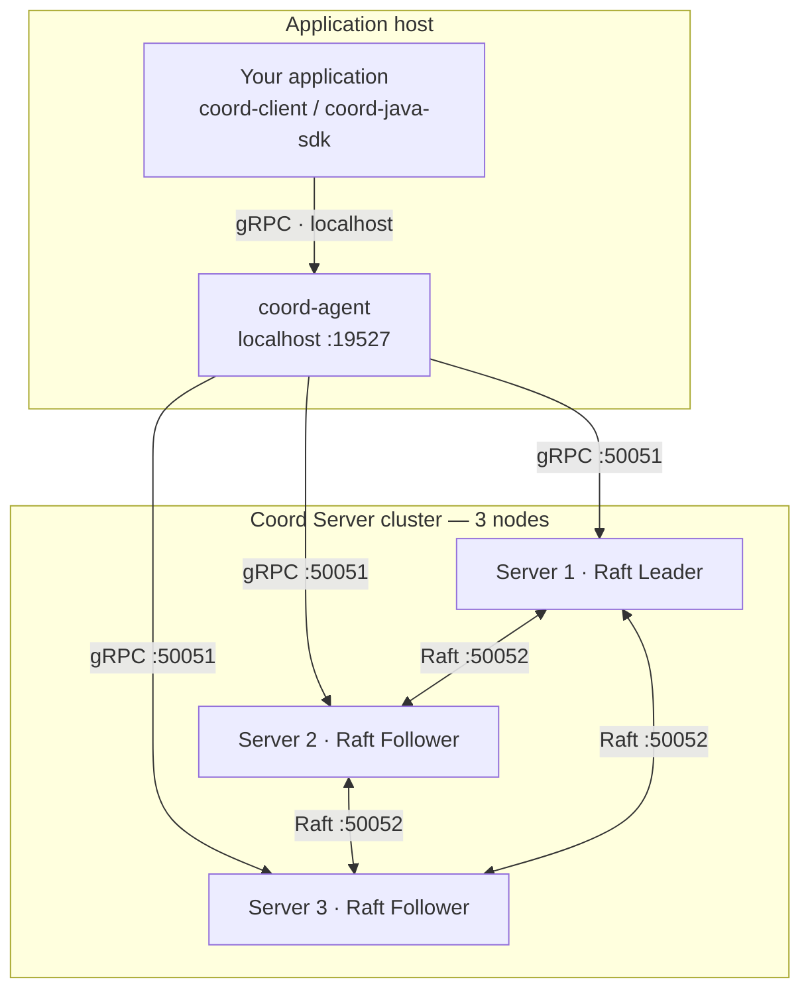

# Coord

<div align="center">

[](LICENSE)
[](rust-toolchain.toml)
[](coord-java-sdk/pom.xml)

**English** · [**简体中文**](README.zh-CN.md)

</div>

**Coord** is a distributed coordination service for microservice platforms. A small Raft-based server cluster provides strongly consistent primitives — key/value storage, atomic transactions, leases, change watches, authentication and encryption at rest. A `coord-agent` daemon runs on every application machine and turns those primitives into the higher-level coordination capabilities that business code actually needs.

> **Agent-first architecture.** Applications never connect to the Coord Server cluster directly. Each machine runs a `coord-agent`; applications connect to it over localhost gRPC (`127.0.0.1:19527`). The agent proxies the core server primitives under the same contract and hosts all higher-level coordination services locally — caching reads, fanning out watches, and keeping local capabilities available even when the cluster link is temporarily lost.

## Why Coord?

If you already know etcd, Consul or ZooKeeper, think of Coord as two layers:

- **A consensus & storage substrate** — linearizable KV / Txn / Watch / Lease over Raft, similar in spirit to etcd, with auth, TLS/mTLS and encryption at rest.
- **A per-machine agent layer** — one `coord-agent` per host exposes service discovery, configuration, distributed locking, ID generation, leader election, events, caching, MQ, workflow, scheduling, rate limiting, feature flags and PKI issuance as local gRPC services under a single contract. Business code talks to one endpoint with one SDK and never deals with cluster topology.

The consistency core is exercised by an in-repo [Jepsen](https://github.com/jepsen-io/jepsen) suite (knossos linearizability checking); see [Testing & verification](#testing--verification) for how to run it and what it covers.

## Architecture


```mermaid
graph TD
    subgraph "Application host"
        APP[Your application<br/>coord-client / coord-java-sdk]
        AGENT[coord-agent<br/>localhost :19527]
    end
    subgraph "Coord Server cluster — 3 nodes"
        S1[Server 1 · Raft Leader]
        S2[Server 2 · Raft Follower]
        S3[Server 3 · Raft Follower]
    end

    APP -->|gRPC · localhost| AGENT
    AGENT -->|gRPC :50051| S1
    AGENT -->|gRPC :50051| S2
    AGENT -->|gRPC :50051| S3
    S1 <-->|Raft :50052| S2
    S2 <-->|Raft :50052| S3
    S3 <-->|Raft :50052| S1
```

Server ports `50051` / `50052` are reachable only by agents — the Server is never exposed to business applications.

## Features

**Server — consensus & storage substrate**

| Area | Notes |
|:---|:---|
| KV / Txn / Watch / Lease | Linearizable reads/writes within a Region; exercised by the in-repo Jepsen project (see [Testing & verification](#testing--verification)) |
| Auth / RBAC | Users, roles and permissions; Ed25519 CCT tokens; login rate limiting |
| TLS / mTLS | gRPC + Raft channels. **Fail-closed by default**: with auth enabled, a non-loopback gRPC bind requires TLS — `[security] tls_cert/tls_key` (add `tls_ca` for mTLS) — otherwise startup is refused; no silent plaintext downgrade. Startup is also refused when (a) auth is disabled **and** the bind address is non-loopback, or (b) the Raft port is non-loopback with neither Raft mTLS nor `raft_shared_secret`. Dev/test only may explicitly opt out via `security.allow_plaintext_remote = true` (default `false`; the startup log will say so). `cargo run -p coord -- dev` stays a loopback-first dev mode (`--allow-insecure` required for a non-loopback bind) |
| Encryption at rest | AES-256-GCM, plus Shamir secret-sharing Seal / Unseal |
| Operations | Snapshots, MVCC compaction, dynamic membership, Prometheus metrics |
| Multi-Raft (opt-in) | Region sharding across multiple Raft groups with an embedded placement driver; enable via `[multi_raft]` (see [`config.example.toml`](config.example.toml)) |

**Agent — the coordination layer your application talks to**

17 builtin gRPC services, toggled per service via the `[services]` / `[plugins]` configuration sections
(the plugin engine's own `Plugin` management service — `Invoke` / `List` — is not a builtin plugin; it is the gateway those plugins are exposed through):

- **Discovery & config:** `Registry` · `ConfigCenter` · `Event`
- **Coordination:** `Lock` · `IdGen` · `LeaderElection`
- **Data & messaging:** `Cache` · `Mq` · `Replica` (ISR replication for Cache/MQ)
- **Automation:** `Workflow` · `Scheduler` · `Policy` · `FeatureFlags`
- **Resilience & security:** `CircuitBreaker` · `RateLimiter` · `Transit` · `Pki`
- **Extensibility:** every service above is hosted as a **builtin plugin** by the plugin manager — one registry owns each service's lifecycle, gRPC surface and health. `Plugin` (`coord.plugin.Plugin`) exposes that unified service/plugin inventory (with per-service health), and loads external wasm/JS plugins when `[plugins]` is enabled (off by default)

> **Stability labels.** Per [`apis/contracts/STATUS.md`](apis/contracts/STATUS.md) — the single
> source of truth, parsed by CI — **all these services are `COMMITTED`**: the 16
> `coord.<domain>.v1` packages plus object storage (`coord.storage`), 17 entries in total.
> No `EXPERIMENTAL` package is open in any form: the four `coord.experimental.*` entries
> never had proto files or consumers. Object storage (`coord.storage`) is a
> Server-side data plane reached through the agent's storage proxy.
>
> **`COMMITTED` is an interface commitment, not a production-readiness claim** — the exact
> scope of each commitment is in [`apis/contracts/WHITEPAPER.md`](apis/contracts/WHITEPAPER.md).
>
> Treat this list as an inventory, not as a support matrix.

Agent extras: core-proxy services (`coord.kv` / `coord.txn` / `coord.lease` / `coord.watch` / `coord.maintenance`) with the same contract as the Server, KV read caching, watch fan-out, and health checks + Prometheus metrics on `127.0.0.1:19528`.

## Quick start

**Prerequisites:** Rust 1.98.1 (pinned by `rust-toolchain.toml`); Java 21 + Maven 3.9+ and Node 22 + pnpm only if you use the Java SDK or the web UI.

```bash
cargo build                                # build all crates
cargo test --workspace --no-fail-fast      # run the full test suite
```

**Single-node dev mode** (server + agent on localhost):

```bash
cargo run -p coord -- dev --fresh
```

Server gRPC listens on `127.0.0.1:50051`; the agent on `127.0.0.1:19527`.

Dev mode enables all builtin agent services except `replication` (dev is a single-agent
topology). `transit` is backed by a **dev-only default KEK** — a fixed, public constant
with no confidentiality (startup WARN); production agents still require injected KEK
material or refuse to start (see [ADR-0009](docs/adr/0009-dev-mode-builtin-services.md)).

**Or run it in a container** (Docker — dev only: authentication off, `root`/`root`):

```bash
docker compose -f deploy/docker-compose/docker-compose.dev.yml up -d --build
```

Host ports are published on loopback only: UI `http://127.0.0.1:50061`, agent `127.0.0.1:19527`,
server gRPC `127.0.0.1:50051`. Reset all data with `down -v`; see
[`deploy/docker-compose/README.md`](deploy/docker-compose/README.md).

**Start a real cluster:**

```bash
# node 1 — bootstrap
cargo run -p coord -- server --bootstrap

# nodes 2 and 3 — join node 1
cargo run -p coord -- server --id 2 --join <node1-grpc-addr>
```

For production, copy [`config.example.toml`](config.example.toml) to each node — identical `auth_root_key` and `raft_shared_secret` everywhere, `bootstrap = true` on the first node only, `join_addr` on the others, and optional mTLS / encryption in the `security` section.

**Run an agent on every machine:**

```bash
cargo run -p coord -- agent --static-peers <server1>:50051,<server2>:50051
cargo run -p coord -- agent --agent-config agent.toml   # services / tls / auth / replication
```

**From your application** — connect to the local agent. `java-example/` is a separate,
self-contained gRPC demo (it does **not** use this SDK and has no README of its own); the
snippet below is the SDK's own API:

```java
import cn.byteforce.coord.sdk.CoordClient;
import cn.byteforce.coord.sdk.CoordConfig;

CoordConfig config = CoordConfig.builder()
        .agentHost("127.0.0.1")
        .agentPort(19527)
        // Production: plaintext to a non-loopback agent is refused (fail-closed);
        // useTls(true) requires a CA and never falls back to plaintext.
        // .useTls(true).tlsCaCertPath("/etc/coord/ca.pem")
        // CCT credentials are read per call, so refresh needs no channel rebuild
        // .authTokenSupplier(() -> credentialStore.currentCct())
        .build();

try (CoordClient client = CoordClient.create(config)) {
    client.configClient().put("/app/config", "value");
    String val = client.configClient().getString("/app/config").orElse(null);

    client.registry().register("order-service", "inst-1", "{}", 30);
    var instances = client.registry().discover("order-service");
}
```

> The snippet above is the **real** SDK (`coord-java-sdk`, Maven group `cn.byteforce`,
> artifact `coord-java-sdk`, version `0.2.1`) — connect via `CoordClient.create(CoordConfig)`.
> It is published on **Maven Central** (`cn.byteforce:coord-java-sdk:0.2.1`); alternatively
> run `mvn -pl coord-java-sdk install` in this repo to build from source. The `java-example/` module is a
> **separate, self-contained** gRPC demo; its
> `cn.byteforce.coord.example.CoordClient` convenience wrapper is example-local
> and is **not** the SDK class.

> **Spring Boot adopters: there is no `coord-spring-boot-starter`, by decision.**
> `coord-java-sdk` is the supported integration surface. You wire it yourself, which is two things:
>
> ```java
> @Bean(destroyMethod = "close")   // CoordClient is Closeable; this is the lifecycle hook
> CoordClient coordClient(CoordConfig config) { return CoordClient.create(config); }
> ```
>
> `close()` matters: it cancels pending watches and MQ subscriptions and shuts the client's
> pools down. If you never call it, they are only cancelled when the process exits (there is
> no shutdown hook). The SDK is what we test — 149 unit/contract tests plus
> `CoordClientIntegrationTest` against a real server + agent in CI (`mvn -Pit`) — so if the
> SDK does not work for you, that is a bug we want, not something you should work around.

Operations CLI: `coord member | snapshot | security | auth | capability | idgen | reset`.

## Project layout

```
coord/
├── coord/               # CLI (server / agent / dev + ops subcommands)
├── coord-proto/         # Protobuf / gRPC contracts
├── coord-core/          # Shared traits & types
├── coord-server/        # Server: Raft, MVCC, Txn, Watch, Lease, Auth, TLS
├── coord-agent/         # Agent daemon — the per-machine coordination layer
├── coord-client/        # Rust client SDK
├── coord-java-sdk/      # Java SDK (cn.byteforce:coord-java-sdk)
├── java-example/        # Java sample application
├── coord-ui/            # Web management UI (React 19 + Vite)
├── jepsen/              # In-repo Jepsen test project + lab
├── apis/contracts/      # Protocol contracts & capability commitments
├── deploy/              # docker-compose (3-node + single-node dev) + Kubernetes StatefulSet
└── monitoring/          # Grafana dashboard + Prometheus rules
```

## Testing & verification

- **Unit / integration tests** — `cargo test --workspace --no-fail-fast` for the Rust workspace; the Java SDK suites run with `mvn -Pit` against a real server + agent (see CI).
- **Jepsen** — [`jepsen/`](jepsen/README.md) is a Clojure + knossos project with `register` / `cas-register` / `multi-register` workloads under kill / pause / partition nemeses, plus a long-running soak profile. Run instructions and scope live in [`jepsen/README.md`](jepsen/README.md).
- **Fast local check** — `scripts/jepsen-check.sh` runs one linearizability smoke test (`chaos_real_kill9_and_linearizability`) in ~2–3 minutes on a warm build; it is not a full Jepsen run.
- **CI** — see [`.github/workflows/ci.yml`](.github/workflows/ci.yml) for the authoritative list: fmt + clippy (`-D warnings`), a panic gate on non-test code, workspace tests, protobuf contract checks (buf lint + format + breaking), `cargo audit` + `cargo deny`, real-process chaos runs, a cross-language error-code contract check, and Java SDK + Java example integration suites.

## Limitations / non-goals

Coord is pre-1.0 and explicit about what it does **not** promise. The maintained list — with
current status and the work required to close each item — is
[`docs/production/ops/boundaries.md`](docs/production/ops/boundaries.md). Highlights:

- **Workflow state is append-only** — no delete/retention API for definitions or instances.
- **Raft log compaction** — automatic snapshots run every 5000 logs by default and logs covered by a snapshot are reclaimed (`raft.max_in_snapshot_log_to_keep` keeps 1000 behind the snapshot for lagging followers); setting `raft.snapshot_logs_since_last = 0` disables both, so logs are never reclaimed (see ADR-0004).
- **Multi-Raft (region mode)** — no dynamic region add/remove; watches cannot span regions.
- **Authentication needs raft quorum** — logins and token refresh require quorum; clients whose credentials have expired cannot operate until quorum returns.
- **`transit` KEK is operator-supplied** — no external KMS integration, and no built-in key-rotation flow. (`coord dev` uses a fixed dev-only default instead; see [ADR-0009](docs/adr/0009-dev-mode-builtin-services.md).)
- **Resource bounds** — plugin queues are bounded; the client port and the agent health listener enforce connection caps (but not connection-lifetime recycling); the cache enforces its configured size limit via a periodic reaper (brief overshoot within the reaper interval is possible); the message queue enforces its byte quota at publish (same-transaction accounting — over-quota and oversize publishes are rejected with `RESOURCE_EXHAUSTED`) and a reaper prunes messages/DLQ past each topic's `retention_secs` (`0` disables time-based pruning).

**Non-goals.** No Spring Boot starter (see [Quick start](#quick-start)).

## Deploy

- **docker-compose:** 3-node cluster（+ single-node dev compose）in [`deploy/docker-compose/`](deploy/docker-compose/README.md)
- **Kubernetes:** StatefulSet with probes & PDB in [`deploy/k8s/statefulset.yaml`](deploy/k8s/statefulset.yaml)
- **Monitoring:** Grafana dashboard + Prometheus rules in [`monitoring/`](monitoring/)
- **Web UI:** see [`coord-ui/README.md`](coord-ui/README.md)

## Status

Version `0.2.2` (pre-1.0). The Raft engine (`openraft`) is an alpha dependency and Coord is **not yet recommended for production**. The consistency core is continuously exercised by the in-repo Jepsen project and CI; see [Testing & verification](#testing--verification) and [Limitations / non-goals](#limitations--non-goals) before adopting.

## Documentation

- Protocol contracts & capability commitments: [`apis/contracts/`](apis/contracts/README.md)
- Capability boundaries & non-goals: [`docs/production/ops/boundaries.md`](docs/production/ops/boundaries.md)
- Server configuration reference: [`config.example.toml`](config.example.toml)
- Vulnerability reporting: [`SECURITY.md`](SECURITY.md)

## Contributing

See [`CONTRIBUTING.md`](CONTRIBUTING.md) and [`CODE_OF_CONDUCT.md`](CODE_OF_CONDUCT.md).

## License

[MIT](LICENSE) © Byteforce Team
