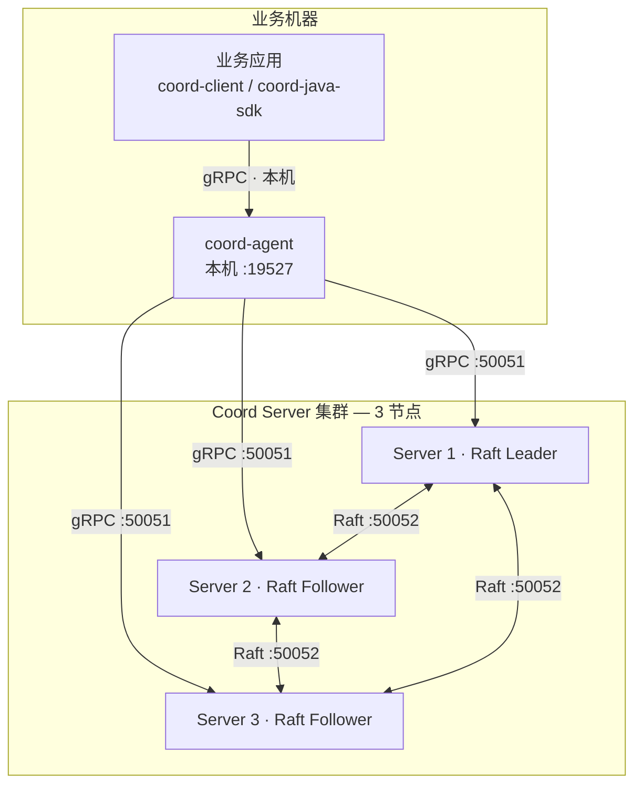

# Coord

<div align="center">

[](LICENSE)
[](rust-toolchain.toml)
[](coord-java-sdk/pom.xml)

[**English**](README.md) · **简体中文**

</div>

**Coord** 是一个面向微服务平台的分布式协调服务。一组基于 Raft 的 Server 集群提供强一致原语——KV 存储、原子事务、租约、变更监听、鉴权与静态加密；每台业务机器上运行的 `coord-agent` 守护进程再把这些原语转化为业务代码真正需要的高级协调能力。

> **Agent 优先架构**：业务应用永不直连 Coord Server 集群。每台机器运行一个 `coord-agent`，应用通过本机 gRPC（`127.0.0.1:19527`）接入。Agent 以同一契约代理 Server 核心原语，并在本机承载全部高级协调服务——缓存读请求、扇出 Watch，即使与集群链路暂时中断，本地协调能力也保持可用。

> **开发声明与承诺级别**：当前项目使用 Deepseek V4 辅助开发，用于学习和验证。**接口承诺（L0）可用**——[`apis/contracts/`](apis/contracts/README.md) 下的协议契约已冻结、已版本化并有 CI 卡口把守；**本项目不声明生产就绪**——生产面与验收门见 [`apis/contracts/WHITEPAPER.md`](apis/contracts/WHITEPAPER.md) §12 与 [`docs/production/production-readiness-plan-2026-09-21.md`](docs/production/production-readiness-plan-2026-09-21.md) §4。
>
> *（2026-09-21 裁定：本条取代原先「不可用于生产环境」的一揽子措辞——它与下方契约承诺互相排斥，见计划 §8 U-01。）*

## 为什么选择 Coord？

如果你熟悉 etcd、Consul 或 ZooKeeper，可以把 Coord 看作两层：

- **共识与存储基座**——基于 Raft 提供线性一致的 KV / Txn / Watch / Lease，能力与 etcd 类似，并内置鉴权、TLS/mTLS 与静态加密；
- **每机 Agent 层**——每台宿主机的 `coord-agent` 以本地 gRPC 服务形式暴露注册发现、配置管理、分布式锁、ID 生成、Leader 选举、事件通知、缓存、消息队列、工作流、调度、限流、特性开关与 PKI 签发等能力，全部收敛在单一契约之下。业务代码只面对一个端点、一个 SDK，完全不需要感知集群拓扑。

一致性核心配有仓库内 [Jepsen](https://github.com/jepsen-io/jepsen) 测试工程（knossos 线性一致性检查）；**运行产物已入仓**（[`docs/production/evidence/`](docs/production/evidence/README.md)），当前口径见「验证与质量」。

## 架构



Server 的 `50051` / `50052` 端口仅对 Agent 可达，**对业务应用永不暴露**。

## 核心能力

**Server —— 共识与存储基座**

| 领域 | 说明 |
|:---|:---|
| KV / Txn / Watch / Lease | 单 Region 内线性一致；Jepsen 工程已就位，**产物已入仓**（见「验证与质量」） |
| Auth / RBAC | 用户 / 角色 / 权限，Ed25519 CCT 令牌，登录限流 |
| TLS / mTLS | gRPC 与 Raft 通道加密。**并非 fail-closed**：`dev` 模式、以及“开启鉴权 + 配了 `raft_shared_secret`”的集群仍会以明文启动。只有在（a）鉴权关闭**且**绑定非 loopback，或（b）Raft 端口非 loopback 且既无 Raft mTLS 又无 `raft_shared_secret` 时才拒绝启动。生产请显式配置 `[tls]` |
| 静态加密 | AES-256-GCM，外加 Shamir 分片的 Seal / Unseal |
| 运维 | 快照、MVCC 压缩、动态成员管理、Prometheus 指标 |
| Multi-Raft（opt-in） | 多 Raft 组 Region 分片 + 内嵌 PD 调度；`[multi_raft]` 显式开启（见 [`config.example.toml`](config.example.toml)） |

**Agent —— 业务应用真正打交道的协调层**

17 个内建 gRPC 服务，通过 `[services]` / `[plugins]` 配置逐项开关
（插件引擎自身的 `Plugin` 管理面——`Invoke` / `List`——不计在内：它是这些服务的对外入口）：

- **发现与配置**：`Registry` · `ConfigCenter` · `Event`
- **协调原语**：`Lock` · `IdGen` · `LeaderElection`
- **数据与消息**：`Cache` · `Mq` · `Replica`（Cache/MQ 的 ISR 复制）
- **流程自动化**：`Workflow` · `Scheduler` · `Policy` · `FeatureFlags`
- **韧性与安全**：`CircuitBreaker` · `RateLimiter` · `Transit` · `Pki`
- **可扩展**：上述服务全部由插件管理器作为**内建插件**承载 —— 一份注册表统一拥有各服务的生命周期、gRPC 面与健康；`Plugin`（`coord.plugin.Plugin`）暴露统一的服务/插件清单（含逐项健康），并在 `[plugins]` 开启时加载外部 wasm/JS 插件（默认关闭）

Agent 附加能力：与 Server 同契约的核心代理服务（`coord.kv` / `coord.txn` / `coord.lease` / `coord.watch` / `coord.maintenance`）、KV 读缓存、Watch 扇出，以及 `127.0.0.1:19528` 上的健康检查与 Prometheus 指标。

> **稳定性标签**：以 [`apis/contracts/STATUS.md`](apis/contracts/STATUS.md)（单一事实来源，CI 解析）为准，上方服务**全部为 `COMMITTED`**——即 16 个 `coord.<domain>.v1` 包 + 对象存储 `coord.storage`，共 17 行台账。`EXPERIMENTAL` 区已在 `contracts/v1.2.0`（2026-09-19）**清空**：原 4 个 `coord.experimental.*` 包从未有 proto 文件与消费者，**不以实验包形态开放任何能力**。`coord.storage` 是 Server 侧数据面，经 Agent 的存储代理可达。
>
> **`COMMITTED` 是接口承诺，不是生产就绪声明**：期限（2026-10-31 / 2026-11-30 / 2026-12-31，以及 `Workflow`、`Scheduler` 的 2027-03-31）是接口冻结期限；生产就绪是另一套更严的判据，见 [`docs/production/production-readiness-plan-2026-09-21.md`](docs/production/production-readiness-plan-2026-09-21.md) §4 的 P1–P9 门。
>
> 本清单是能力清单，不是支持矩阵。

## 快速开始

**前置条件**：Rust 1.98.1（由 `rust-toolchain.toml` 固定）；Java 21 + Maven 3.9+ 与 Node 22 + pnpm 仅在需要使用 Java SDK 或 Web 界面时安装。

```bash
cargo build                                # 构建全部 crate
cargo test --workspace --no-fail-fast      # 运行全量测试
```

**单节点开发模式**（本机 Server + Agent）：

```bash
cargo run -p coord -- dev --fresh
```

Server gRPC 监听 `127.0.0.1:50051`，Agent 监听 `127.0.0.1:19527`。

**启动真实集群**：

```bash
# 节点 1 —— 引导
cargo run -p coord -- server --bootstrap

# 节点 2、3 —— 加入节点 1
cargo run -p coord -- server --id 2 --join <node1-grpc-addr>
```

生产部署请把 [`config.example.toml`](config.example.toml) 复制到每个节点：所有节点 `auth_root_key` 与 `raft_shared_secret` 一致，仅首节点 `bootstrap = true`，其余节点填 `join_addr`；`security` 段可选 mTLS 与静态加密。

**每台机器运行 Agent**：

```bash
cargo run -p coord -- agent --static-peers <server1>:50051,<server2>:50051
cargo run -p coord -- agent --agent-config agent.toml   # services / tls / auth / replication
```

**从业务应用接入**——连接本机 Agent（完整示例见 [`java-example/`](java-example/)）：

```java
import cn.byteforce.coord.sdk.CoordClient;
import cn.byteforce.coord.sdk.CoordConfig;

CoordConfig config = CoordConfig.builder()
        .agentHost("127.0.0.1")
        .agentPort(19527)
        // 生产：TLS fail-closed（缺 CA 证书即拒绝连接，不静默降级明文）
        // .useTls(true).tlsCaCertPath("/etc/coord/ca.pem")
        // CCT 凭据：每次调用读取当前 token，刷新无需重建 channel
        // .authTokenSupplier(() -> credentialStore.currentCct())
        .build();

try (CoordClient client = CoordClient.create(config)) {
    client.configClient().put("/app/config", "value");
    String val = client.configClient().getString("/app/config").orElse(null);

    client.registry().register("order-service", "inst-1", "{}", 30);
    var instances = client.registry().discover("order-service");
}
```

> 上面是**真 SDK**（`coord-java-sdk`，group `cn.byteforce.coord`）的用法——入口是
> `CoordClient.create(CoordConfig)`。`java-example/` 是**独立的自包含** gRPC 示例；
> 其中的 `cn.byteforce.coord.example.CoordClient` 是示例本地包装类，**不是** SDK 的类。

运维子命令：`coord member | snapshot | security | auth | capability | idgen | reset`。

## 项目结构

```
coord/
├── coord/               # CLI 入口（server / agent / dev + 运维子命令）
├── coord-proto/         # Protobuf / gRPC 契约
├── coord-core/          # 公共 Trait 与类型
├── coord-server/        # Server：Raft / MVCC / Txn / Watch / Lease / Auth / TLS
├── coord-agent/         # Agent 守护进程——每机协调层
├── coord-client/        # Rust 客户端 SDK
├── coord-java-sdk/      # Java SDK（cn.byteforce:coord-java-sdk）
├── java-example/        # Java 接入示例
├── coord-ui/            # Web 管理界面（React 19 + Vite）
├── jepsen/              # 仓库内 Jepsen 测试工程与 lab
├── apis/contracts/      # 协议契约与能力承诺
├── deploy/              # docker-compose 三节点 + Kubernetes StatefulSet
└── monitoring/          # Grafana 面板 + Prometheus 规则
```

## 验证与质量

- **Jepsen（工程已就位）**——仓库内 Clojure + knossos 工程（[`jepsen/`](jepsen/README.md)）覆盖 `register` / `cas-register` / `multi-register` 负载 × kill / pause / partition 故障注入，另有 [`jepsen/README.md`](jepsen/README.md) 中的长时浸泡方案。**运行产物已入仓**：[`docs/production/evidence/`](docs/production/evidence/README.md) 现有 **28 份** Jepsen/soak 运行归档（每份含 `MANIFEST.md` + `sha256sums.txt`）+ Java 集成运行产物，`MANIFEST.md` 记录 commit、精确命令与工作区是否 dirty。**这些归档的 worktree 一律为 dirty、参数确认 ③ 未满签**，故它们是「提交前工作树的运行记录」，**不构成验收级证据**（见计划 §2.3）；逐条结论的认证状态以 [`jepsen/docs/coord-findings.md`](jepsen/docs/coord-findings.md) 为准——请勿据此推断「线性一致已整体认证」；
- **快速本地收口**——`scripts/jepsen-check.sh` 只跑**一个**线性一致冒烟用例（`chaos_real_kill9_and_linearizability`），热构建下约 2–3 分钟；**不是** Jepsen 运行，也不复现 负载 × 故障注入 矩阵；
- **CI**——权威清单见 [`.github/workflows/ci.yml`](.github/workflows/ci.yml)：fmt + clippy（`-D warnings`）、非测试代码 panic 卡口、workspace 测试、proto 契约检查（buf lint + format + breaking）、`cargo audit` + `cargo deny`、真实进程 chaos 运行、跨语言错误码契约检查，以及 Java SDK / Java 示例集成套件；
- **证据**——可复现的运行产物归档在 [`docs/production/evidence/`](docs/production/evidence/README.md)（`bash scripts/collect-evidence.sh <场景>`）。每个 `MANIFEST.md` 记录 commit、精确命令与工作区是否 dirty；`commit`/`command` 字段无法复现的产物应视为未验证。

## 部署

- **docker-compose**：三节点集群见 [`deploy/docker-compose/`](deploy/docker-compose/README.md)
- **Kubernetes**：含探针与 PDB 的 StatefulSet 见 [`deploy/k8s/statefulset.yaml`](deploy/k8s/statefulset.yaml)
- **监控**：Grafana 面板 + Prometheus 告警规则见 [`monitoring/`](monitoring/)
- **Web 界面**：见 [`coord-ui/README.md`](coord-ui/README.md)

## 状态

版本 `0.2.0`（pre-1.0）。Raft 引擎（`openraft`）为 alpha 依赖，Coord **暂不建议用于生产**。Jepsen 运行产物**已**入仓（[`docs/production/evidence/`](docs/production/evidence/README.md)），但那是逐次运行的记录，不构成整体认证——核心一致性与故障恢复语义仍带有未闭环发现，见 [`jepsen/docs/coord-findings.md`](jepsen/docs/coord-findings.md)。

本轮**有意保留**的已知缺口（含证据与影响）逐条列在
[`docs/production/remaining-known-gaps.md`](docs/production/remaining-known-gaps.md)（英文）；
引入前请先读。

## 文档

- 协议契约与能力承诺：[`apis/contracts/`](apis/contracts/README.md)
- **尚未关闭的已知缺口（引入前必读）：** [`docs/production/remaining-known-gaps.md`](docs/production/remaining-known-gaps.md)
- Server 配置参考：[`config.example.toml`](config.example.toml)
- 漏洞报告：[`SECURITY.md`](SECURITY.md)

## 参与贡献

见 [`CONTRIBUTING.md`](CONTRIBUTING.md) 与 [`CODE_OF_CONDUCT.md`](CODE_OF_CONDUCT.md)。

## 许可

[MIT](LICENSE) © Byteforce Team
