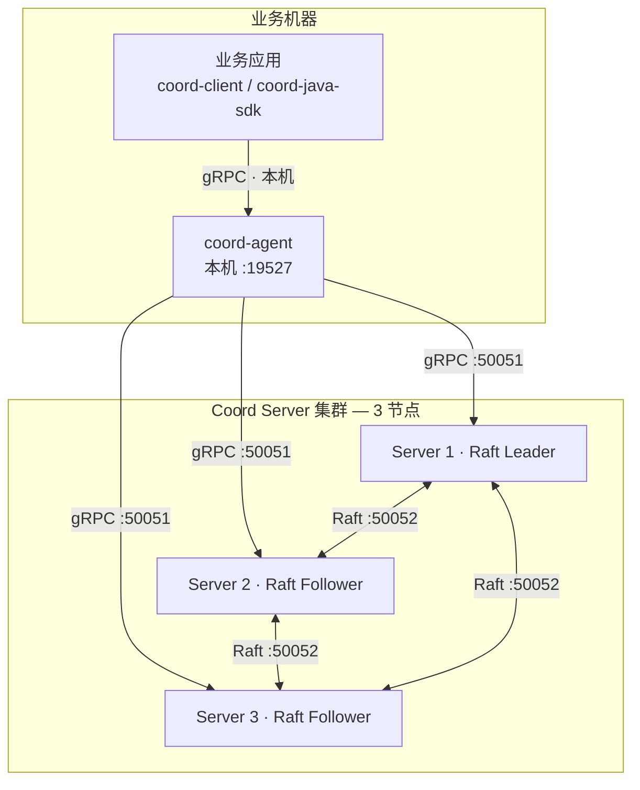

# Coord

<div align="center">

[](LICENSE)
[](rust-toolchain.toml)
[](coord-java-sdk/pom.xml)

[**English**](README.md) · **简体中文**

</div>

**Coord** 是一个面向微服务平台的分布式协调服务。一组基于 Raft 的 Server 集群提供强一致原语——KV 存储、原子事务、租约、变更监听、鉴权与静态加密；每台业务机器上运行的 `coord-agent` 守护进程再把这些原语转化为业务代码真正需要的高级协调能力。

> **Agent 优先架构**：业务应用永不直连 Coord Server 集群。每台机器运行一个 `coord-agent`，应用通过本机 gRPC（`127.0.0.1:19527`）接入。Agent 以同一契约代理 Server 核心原语，并在本机承载全部高级协调服务——缓存读请求、扇出 Watch，即使与集群链路暂时中断，本地协调能力也保持可用。

## 为什么选择 Coord？

如果你熟悉 etcd、Consul 或 ZooKeeper，可以把 Coord 看作两层：

- **共识与存储基座**——基于 Raft 提供线性一致的 KV / Txn / Watch / Lease，能力与 etcd 类似，并内置鉴权、TLS/mTLS 与静态加密；
- **每机 Agent 层**——每台宿主机的 `coord-agent` 以本地 gRPC 服务形式暴露注册发现、配置管理、分布式锁、ID 生成、Leader 选举、事件通知、缓存、消息队列、工作流、调度、限流、特性开关与 PKI 签发等能力，全部收敛在单一契约之下。业务代码只面对一个端点、一个 SDK，完全不需要感知集群拓扑。

一致性核心配有仓库内 [Jepsen](https://github.com/jepsen-io/jepsen) 测试工程（knossos 线性一致性检查）；运行方式与覆盖范围见「测试与验证」。

## 架构


```mermaid
graph TD
    subgraph "业务机器"
        APP[业务应用<br/>coord-client / coord-java-sdk]
        AGENT[coord-agent<br/>本机 :19527]
    end
    subgraph "Coord Server 集群 — 3 节点"
        S1[Server 1 · Raft Leader]
        S2[Server 2 · Raft Follower]
        S3[Server 3 · Raft Follower]
    end

    APP -->|gRPC · 本机| AGENT
    AGENT -->|gRPC :50051| S1
    AGENT -->|gRPC :50051| S2
    AGENT -->|gRPC :50051| S3
    S1 <-->|Raft :50052| S2
    S2 <-->|Raft :50052| S3
    S3 <-->|Raft :50052| S1
```

Server 的 `50051` / `50052` 端口仅对 Agent 可达，**对业务应用永不暴露**。

## 核心能力

**Server —— 共识与存储基座**

| 领域 | 说明 |
|:---|:---|
| KV / Txn / Watch / Lease | 单 Region 内线性一致；由仓库内 Jepsen 工程覆盖（见「测试与验证」） |
| Auth / RBAC | 用户 / 角色 / 权限，Ed25519 CCT 令牌，登录限流 |
| TLS / mTLS | gRPC 与 Raft 通道加密。**默认 fail-closed**：鉴权开启时，gRPC 绑定非 loopback 必须配置 TLS（`[security] tls_cert/tls_key`，配 `tls_ca` 即 mTLS），否则拒绝启动、不静默降级明文；此外（a）鉴权关闭且绑定非 loopback、（b）Raft 端口非 loopback 且既无 Raft mTLS 又无 `raft_shared_secret`，同样拒绝启动。dev/test 若确需明文远端，只能显式 `security.allow_plaintext_remote = true`（默认 false，启动日志会 WARN 明示）。`coord -- dev` 仍是 loopback 优先的 dev 模式（绑非 loopback 必须 `--allow-insecure`） |
| 静态加密 | AES-256-GCM，外加 Shamir 分片的 Seal / Unseal |
| 运维 | 快照、MVCC 压缩、动态成员管理、Prometheus 指标 |
| Multi-Raft（opt-in） | 多 Raft 组 Region 分片 + 内嵌 PD 调度；`[multi_raft]` 显式开启（见 [`config.example.toml`](config.example.toml)） |

**Agent —— 业务应用真正打交道的协调层**

17 个内建 gRPC 服务，通过 `[services]` / `[plugins]` 配置逐项开关
（插件引擎自身的 `Plugin` 管理面——`Invoke` / `List`——不计在内：它是这些服务的对外入口）：

- **发现与配置**：`Registry` · `ConfigCenter` · `Event`
- **协调原语**：`Lock` · `IdGen` · `LeaderElection`
- **数据与消息**：`Cache` · `Mq` · `Replica`（Cache/MQ 的 ISR 复制）
- **流程自动化**：`Workflow` · `Scheduler` · `Policy` · `FeatureFlags`
- **韧性与安全**：`CircuitBreaker` · `RateLimiter` · `Transit` · `Pki`
- **可扩展**：上述服务全部由插件管理器作为**内建插件**承载 —— 一份注册表统一拥有各服务的生命周期、gRPC 面与健康；`Plugin`（`coord.plugin.Plugin`）暴露统一的服务/插件清单（含逐项健康），并在 `[plugins]` 开启时加载外部 wasm/JS 插件（默认关闭）

Agent 附加能力：与 Server 同契约的核心代理服务（`coord.kv` / `coord.txn` / `coord.lease` / `coord.watch` / `coord.maintenance`）、KV 读缓存、Watch 扇出，以及 `127.0.0.1:19528` 上的健康检查与 Prometheus 指标。

> **稳定性标签**：以 [`apis/contracts/STATUS.md`](apis/contracts/STATUS.md)（单一事实来源，CI 解析）为准，上方服务**全部为 `COMMITTED`**——16 个 `coord.<domain>.v1` 包 + 对象存储 `coord.storage`，共 17 个条目。**当前没有以实验包形态开放的能力**：`coord.experimental.*` 的四个条目从未有 proto 文件与消费者。`coord.storage` 是 Server 侧数据面，经 Agent 的存储代理可达。
>
> **`COMMITTED` 是接口承诺，不是生产就绪声明**——每项承诺的准确范围以 [`apis/contracts/WHITEPAPER.md`](apis/contracts/WHITEPAPER.md) 为准。
>
> 本清单是能力清单，不是支持矩阵。

## 快速开始

**前置条件**：Rust 1.98.1（由 `rust-toolchain.toml` 固定）；Java 21 + Maven 3.9+ 与 Node 22 + pnpm 仅在需要使用 Java SDK 或 Web 界面时安装。

```bash
cargo build                                # 构建全部 crate
cargo test --workspace --no-fail-fast      # 运行全量测试
```

**单节点开发模式**（本机 Server + Agent）：

```bash
cargo run -p coord -- dev --fresh
```

Server gRPC 监听 `127.0.0.1:50051`，Agent 监听 `127.0.0.1:19527`。

**或在容器中运行**（Docker，仅限本地开发：鉴权关闭，`root`/`root`）：

```bash
docker compose -f deploy/docker-compose/docker-compose.dev.yml up -d --build
```

宿主端口仅发布到 loopback：UI `http://127.0.0.1:50061`、Agent `127.0.0.1:19527`、
Server gRPC `127.0.0.1:50051`。`down -v` 重置全部数据；细节见
[`deploy/docker-compose/README.md`](deploy/docker-compose/README.md)。

**启动真实集群**：

```bash
# 节点 1 —— 引导
cargo run -p coord -- server --bootstrap

# 节点 2、3 —— 加入节点 1
cargo run -p coord -- server --id 2 --join <node1-grpc-addr>
```

生产部署请把 [`config.example.toml`](config.example.toml) 复制到每个节点：所有节点 `auth_root_key` 与 `raft_shared_secret` 一致，仅首节点 `bootstrap = true`，其余节点填 `join_addr`；`security` 段可选 mTLS 与静态加密。

**每台机器运行 Agent**：

```bash
cargo run -p coord -- agent --static-peers <server1>:50051,<server2>:50051
cargo run -p coord -- agent --agent-config agent.toml   # services / tls / auth / replication
```

**从业务应用接入**——连接本机 Agent；下面片段是 SDK 自身的 API（[`java-example/`](java-example/) 是独立示例，不使用本 SDK）：

```java
import cn.byteforce.coord.sdk.CoordClient;
import cn.byteforce.coord.sdk.CoordConfig;

CoordConfig config = CoordConfig.builder()
        .agentHost("127.0.0.1")
        .agentPort(19527)
        // 生产：连非 loopback agent 的明文通道默认被拒（fail-closed）；
        // useTls(true) 必须提供 CA 证书，不会静默降级明文
        // .useTls(true).tlsCaCertPath("/etc/coord/ca.pem")
        // CCT 凭据：每次调用读取当前 token，刷新无需重建 channel
        // .authTokenSupplier(() -> credentialStore.currentCct())
        .build();

try (CoordClient client = CoordClient.create(config)) {
    client.configClient().put("/app/config", "value");
    String val = client.configClient().getString("/app/config").orElse(null);

    client.registry().register("order-service", "inst-1", "{}", 30);
    var instances = client.registry().discover("order-service");
}
```

> 上面是**真 SDK**（`coord-java-sdk`，group `cn.byteforce`，artifact `coord-java-sdk`）的用法——入口是
> `CoordClient.create(CoordConfig)`。SDK 版本 `0.2.0`，**未发布到任何仓库**：需先在仓库内执行
> `mvn -pl coord-java-sdk install`。`java-example/` 是**独立的自包含** gRPC 示例；
> 其中的 `cn.byteforce.coord.example.CoordClient` 是示例本地包装类，**不是** SDK 的类。

> **Spring Boot 用户：本仓库不提供 `coord-spring-boot-starter`（产品决策）。**
> `coord-java-sdk` 是受支持的集成面，接线由使用方完成，只有两件事：
>
> ```java
> @Bean(destroyMethod = "close")   // CoordClient 是 Closeable，这是生命周期钩子
> CoordClient coordClient(CoordConfig config) { return CoordClient.create(config); }
> ```
>
> `close()` 很重要：它会取消未完成的 watch 与 MQ 订阅，并关闭客户端的连接池；不调用则它们
> 只在进程退出时才被取消（没有 shutdown hook）。SDK 是我们测试的对象——149 个单元/契约测试
> 外加 CI 中针对真实 server + agent 的 `CoordClientIntegrationTest`（`mvn -Pit`）——所以
> SDK 对你不可用就是我们想修的 bug，而不是需要你自己绕开的问题。

运维子命令：`coord member | snapshot | security | auth | capability | idgen | reset`。

## 项目结构

```
coord/
├── coord/               # CLI 入口（server / agent / dev + 运维子命令）
├── coord-proto/         # Protobuf / gRPC 契约
├── coord-core/          # 公共 Trait 与类型
├── coord-server/        # Server：Raft / MVCC / Txn / Watch / Lease / Auth / TLS
├── coord-agent/         # Agent 守护进程——每机协调层
├── coord-client/        # Rust 客户端 SDK
├── coord-java-sdk/      # Java SDK（cn.byteforce:coord-java-sdk）
├── java-example/        # Java 接入示例
├── coord-ui/            # Web 管理界面（React 19 + Vite）
├── jepsen/              # 仓库内 Jepsen 测试工程与 lab
├── apis/contracts/      # 协议契约与能力承诺
├── deploy/              # docker-compose 三节点/单节点 dev + Kubernetes StatefulSet
└── monitoring/          # Grafana 面板 + Prometheus 规则
```

## 测试与验证

- **单元 / 集成测试**——Rust 工作区：`cargo test --workspace --no-fail-fast`；Java SDK 套件在 CI 中以 `mvn -Pit` 对真实 server + agent 运行。
- **Jepsen**——[`jepsen/`](jepsen/README.md) 是 Clojure + knossos 工程，覆盖 `register` / `cas-register` / `multi-register` 负载 × kill / pause / partition 故障注入，另有长时浸泡方案；运行方式与覆盖范围见 [`jepsen/README.md`](jepsen/README.md)。
- **快速本地检查**——`scripts/jepsen-check.sh` 只跑一个线性一致冒烟用例（`chaos_real_kill9_and_linearizability`），热构建下约 2–3 分钟；不是完整 Jepsen 运行。
- **CI**——权威清单见 [`.github/workflows/ci.yml`](.github/workflows/ci.yml)：fmt + clippy（`-D warnings`）、非测试代码 panic 检查、workspace 测试、proto 契约检查（buf lint + format + breaking）、`cargo audit` + `cargo deny`、真实进程 chaos 运行、跨语言错误码契约检查，以及 Java SDK / Java 示例集成套件。

## 限制与非目标

Coord 处于 pre-1.0，并明确列出**不承诺**的事项；完整清单（含现状与补齐路径）维护在
[`docs/production/ops/boundaries.md`](docs/production/ops/boundaries.md)。摘要：

- **工作流状态 append-only**——定义与实例均无删除/保留 API。
- **Raft 日志压缩**——缺省每 5000 条自动快照并回收已入快照的日志（保留窗口 `raft.max_in_snapshot_log_to_keep`，默认保留 1000 条供落后副本追赶）；`raft.snapshot_logs_since_last = 0` 会同时关闭两者，日志不再回收（见 ADR-0004）。
- **Multi-Raft（region 模式）**——不支持动态增删 region；watch 不能跨 region。
- **鉴权依赖 raft quorum**——登录与令牌刷新需要 quorum；凭据过期的客户端在 quorum 恢复前不可用。
- **`transit` 的 KEK 由运维注入**——不接外部 KMS，也没有内建的材料轮换流程。
- **资源边界**——插件队列有界；客户端口与 agent 健康监听均有连接上限（但无连接寿命回收）；
  缓存容量上界由 reaper 周期强制（默认 1GB；周期内可短暂超界，指标可观测）；
  消息队列的字节配额在 publish 入口严格强制（同事务记账，超界拒绝 `RESOURCE_EXHAUSTED`），
  过期消息/DLQ 由 reaper 按 topic 的 `retention_secs` 周期回收（0 = 不按时间回收）。

**非目标**：不提供 Spring Boot starter（见「快速开始」）。

## 部署

- **docker-compose**：三节点集群与单节点 dev 组合见 [`deploy/docker-compose/`](deploy/docker-compose/README.md)
- **Kubernetes**：含探针与 PDB 的 StatefulSet 见 [`deploy/k8s/statefulset.yaml`](deploy/k8s/statefulset.yaml)
- **监控**：Grafana 面板 + Prometheus 告警规则见 [`monitoring/`](monitoring/)
- **Web 界面**：见 [`coord-ui/README.md`](coord-ui/README.md)

## 状态

版本 `0.2.0`（pre-1.0）。Raft 引擎（`openraft`）为 alpha 依赖，Coord **暂不建议用于生产**。一致性核心由仓库内 Jepsen 工程与 CI 持续检验；引入前请阅读「测试与验证」与「限制与非目标」。

## 文档

- 协议契约与能力承诺：[`apis/contracts/`](apis/contracts/README.md)
- 能力边界与非目标：[`docs/production/ops/boundaries.md`](docs/production/ops/boundaries.md)
- Server 配置参考：[`config.example.toml`](config.example.toml)
- 漏洞报告：[`SECURITY.md`](SECURITY.md)

## 参与贡献

见 [`CONTRIBUTING.md`](CONTRIBUTING.md) 与 [`CODE_OF_CONDUCT.md`](CODE_OF_CONDUCT.md)。

## 许可

[MIT](LICENSE) © Byteforce Team
